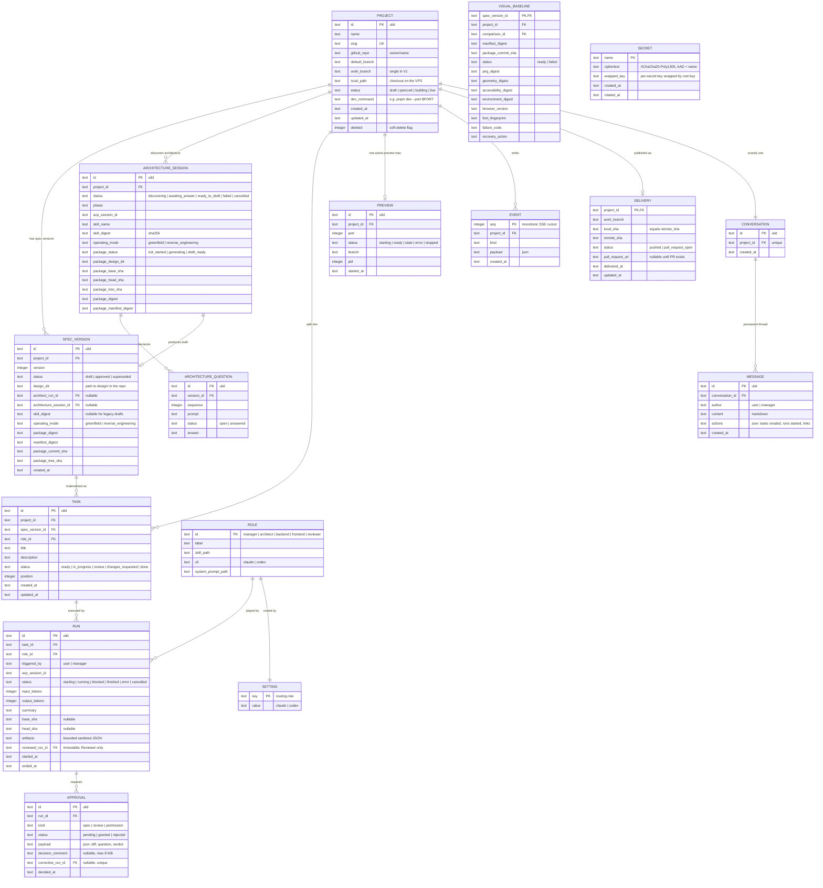

# LaToile — Architecture Specification

> **Date**: 2026-08-15
> **Status**: V1 implemented; full Codex ACP vertical slice verified on 2026-08-18
> **Origin**: app-architect-brainstorm session, Mode A (greenfield) informed by audits of Firetower, AionCore/AionUi, and IgnitionRAG.

## 1. Vision

**LaToile is an AI-native, single-user, self-hosted project workbench.** The central entity is the **project** — not the conversation (AionUi), not the detached session (Firetower). The user chats with a per-project **Manager** agent; the Manager turns discussion into specifications (via the Architect), tasks, and runs by executor agents (backend, frontend, reviewer). The application under construction renders live (web preview, mobile viewport first). Nothing merges without explicit human approval.

Name: la Toile (the Webway, WH40k) — the parallel network where agents work; also "la toile" = the web.

## 2. Structural decisions (locked)

| # | Decision | Rejected alternative |
|---|----------|----------------------|
| D1 | Single user first, self-hosted VPS, single token | Multi-tenant / SaaS — deferred; the model anticipates nothing beyond the token |
| D2 | **Selective** reuse of AionCore patterns | Hard fork — couples us to their release cadence and a 24-crate third-party codebase |
| D3 | Preview = web apps, mobile-first | All targets (mobile emulator, desktop) — out of V1 |
| D4 | Fixed roles: Manager, Architect, Backend, Frontend, Reviewer | Configurable teams — V2 |
| D5 | Single work branch per project (V1) | Branch-per-run + integration — real parallelism, V2 |
| D6 | Free chat only with the Manager; executors run structured tasks | Per-agent chat |
| D7 | HTML mockups = the Frontend agent's visual contract | Mockups as mere reference |
| D8 | Design artifacts live in the project repo (`design/`); the DB stores metadata only | Everything in the database — hides artifacts from git and agents |
| D9 | Token auth on every product route, preview included; only `/api/health` is open | Open preview |
| D10 | Preview auto-reloads when a frontend run finishes | Manual reload |
| D11 | UI internationalized from day one: French + English, message catalogs, no hardcoded strings; the Manager answers in the user's language | FR-only now, retrofit later — retrofitting i18n costs 10× more |
| D12 | An executor is reviewed by the dedicated Reviewer before the owner sees a review decision | Ask the owner to inspect every executor result directly |
| D13 | Mutating ACP requests block the run and require an exact, one-shot owner decision; hard denials are never grantable | Trust the agent prompt or auto-allow all workspace tools |
| D14 | Delivery is an explicit owner action: verify approved SHAs, push without force, verify the remote SHA, then find or create a PR; never merge | Push automatically when a run finishes or merge through the application |
| D15 | A restart invalidates process-backed rows before HTTP readiness; the service cgroup reaps crash orphans, and backup always pairs SQLite with the external root key | Resume unknown processes, signal persisted PIDs, or back up the database alone |
| D16 | Spec approval revalidates a complete machine-readable visual manifest and exact Git/content provenance; approval, supersession, task binding and event are one transaction | Trust validation performed only when the Architect originally generated the draft |
| D17 | Every required P0 mockup is rendered by isolated Chromium before approval; immutable PNG, DOM geometry, accessibility and environment hashes gate approval and dispatch | Ad-hoc screenshots or Reviewer self-reported measurements |
| D18 | A finished frontend run is captured from the exact supervised loopback route and compared to its immutable baseline; fixed server thresholds classify real pixel, geometry and accessibility evidence | Reviewer prose, manual screenshots or an unrestricted browser session |
| D19 | Reviewer V2 is immutably bound to one executor run; the server selects the complete current project/spec evidence set and model echoes cannot select or override it | Self-reported frames, stale evidence reuse, brittle model hash copying or trusting a model-supplied status |
| D20 | The owner decides from authenticated immutable artifacts: baseline/render side-by-side, overlay and heatmap with scenario metadata, server metrics and provenance; failed gates disable approval | A model-authored visual summary or unauthenticated image links |

## 3. Domain model

### 3.1 Bounded contexts

| Context | Responsibility | Entities |
|---|---|---|
| Project | lifecycle, repo link, state | `Project` |
| Design | Socratic discovery, versioned spec, artifacts | `ArchitectureSession`, `ArchitectureQuestion`, `SpecVersion`, `VisualBaseline`, `VisualComparison` |
| Orchestration | roles, tasks, runs, approvals | `Role`, `Task`, `Run`, `Approval` |
| Conversation | the Manager thread | `Conversation`, `Message` |
| Preview | dev server, port, state | `Preview` |
| Delivery | verified work-branch publication | `Delivery` |
| Integrations | GitHub, provider CLIs, skill catalog | (infrastructure clients) |
| Journal | events, SSE cursor | `Event` |
| Secrets | encrypted tokens | `Secret` |

### 3.2 Invariants

1. One active run per task (DB: partial unique index).
2. One active preview per project (same pattern).
3. One `approved` `SpecVersion` per project (same pattern).
4. `Task.status = done` requires a `granted` `Approval` of kind `review` — enforced by the domain state machine, not SQL.
5. An executor run carries: task + spec excerpts + role skill. Never free-form chat.
6. The preview starts in the canonical project checkout and records the declared
   `work_branch`. V1 refreshes/recycles the process after executor completion;
   delivery performs the exact current-branch check before publication.
7. The Manager never receives dangerous permissions; it does not write code.
8. Every fixed role has one persisted provider assignment (`claude` or
   `codex`). A change affects the next fresh executor session; changing the
   Manager provider evicts its persistent session before the next message.
9. A new run receives its `ProjectId` explicitly at the agent port. Its task
   and run rows are persisted only after the ACP handshake succeeds, so a
   failed spawn leaves no active database ghost.
10. A terminal executor run stores only bounded, sanitized evidence:
    `base_sha`, `head_sha`, activity classes, commits, changed paths and diff
    statistics. Raw tool input and hidden reasoning never enter SQLite.
11. A mutating executor tool request parks the exact run and creates one
    permission approval. Timeout, cancellation and restart reject it
    fail-closed. The Manager cannot receive mutating permissions; `.env`,
    Docker and paths outside the project checkout are hard-denied.
12. Delivery requires every selected task to be `done` through a granted
    Reviewer decision, no pending approval or active run, a clean checkout on
    the stored work branch, and every approved executor SHA to be an ancestor
    of the pushed HEAD. `local_sha = remote_sha` is a domain and SQL invariant.
13. One active architecture session exists per project. It pins the complete
    `app-architect-brainstorm` SHA-256 and detected operating mode before the
    first question; every answer is durable before the next provider turn. The
    initial provider contract requires a question. A premature
    `ready_to_draft` receives one no-answer discovery guard retry in the same
    session; a repeated skip fails the session closed. After any durable owner
    answer, an invalid or regressing provider contract receives at most one
    protocol-only repair turn in the same pinned session. The repair carries no
    new owner answer, is fully revalidated, and a second invalid turn fails the
    session closed.
14. Architecture generation runs in a detached worktree at a recorded base
    SHA. The Architect has no shell and can mutate only one versioned
    `design/v…/` directory. LaToile rejects any other path, validates the
    mandatory spec/ADR/guardian/flow/token/gallery/P0 inventory, commits the
    package itself and integrates only that verified commit by fast-forward.
    Manifest schema, skill digest and operating mode are bound from the
    server-owned session before validation/commit; the model cannot attest or
    override its own provenance. A content-validation failure receives at most
    two repair turns in the same ACP session and detached worktree, with no new
    owner answer or permission expansion. Path confinement failures are never
    sent back for repair and fail immediately.
15. A generated draft pins architecture-session id, skill digest, operating
    mode, package digest, manifest digest, commit SHA and tree SHA. Session, draft and
    `SpecVersionCreated` event become visible in one SQLite transaction.
16. The package manifest enumerates every `.md`/`.html` deliverable exactly
    once. Every P0 contract has a unique stable comparison id, screen, state,
    locale, viewport, scale factor and mockup whose HTML pins the same fields.
17. Approval reruns Git ancestry/tree/cleanliness, inventory, network-isolation,
    token and content-digest checks. It then atomically supersedes the previous
    spec, approves the exact draft, marks the project specced, binds waiting
    tasks and journals every immutable digest. Drift blocks approval, artifact
    rendering, executor dispatch and Reviewer context; a new draft is required.
18. Every P0 scenario also declares a live route, synthetic fixture, theme,
    readiness selector, stable measured selectors and an explicit mask subset.
    Capture rejects missing/ambiguous selectors and never invents a mask.
19. Isolated Chromium blocks external URL schemes, disables motion and records
    the exact browser binary/version plus a font fingerprint. PNG, canonical
    DOM geometry and browser accessibility snapshots are content-addressed;
    successful evidence is immutable. Approval and dispatch require one ready
    baseline matching every scenario and the exact spec manifest/commit.
    Accessibility canonicalization excludes only the root document transport
    URL (`about:blank` versus the supervised loopback URL). Capture V3 installs
    one deterministic synthetic document base in both contexts so relative
    links resolve identically; changed link destinations and every other
    semantic AX property remain compared. Older protocol baselines fail with an
    environment mismatch and require a new approved version.
20. A finished frontend run replays the same route, fixture, locale, theme,
    viewport, readiness, selector and approved-mask contract. The fresh browser
    runs only after a ready preview has transitioned to `stale` and its dev
    process has been recycled, including for corrective runs. It has a cleared
    process environment and an exact loopback-origin network allowlist. Render,
    pixel diff, heatmap, geometry changes, accessibility changes and environment
    are immutable and hashed. Domain-owned thresholds classify `invalid`,
    `blocking`, `reservation` or `passed`; invalid evidence carries no fabricated
    pixel metrics.
21. A Reviewer run has one immutable `reviewed_run_id`. V2 output declares
    judgement and visual applicability but cannot select evidence or emit
    trusted ids, hashes, status, metrics or gate fields. The server loads the
    complete set for that run, current project and approved task spec,
    reconstructs the payload from stored evidence and canonicalizes every failed gate to
    `changes_requested`. Only trusted approvable V2 payloads may be granted;
    historic V1 approvals stay readable and non-grantable. The verdict rubric
    reserves `changes_requested` for concrete blocking correctness, security,
    approved-spec or stated acceptance defects; optional enhancements and
    unstated scope are non-blocking reservations.
22. The Review UI loads only evidence ids present in the trusted V2 envelope,
    resolves their current server rows and approved manifest scenarios, and
    fetches baseline, render and heatmap through bearer-authenticated routes.
    Missing, mismatched, invalid or blocking evidence remains visible and can
    never enable approval. A rejection requires a comment and links exactly one
    corrective run whose new evidence ids retain the original baseline digest.

### 3.3 Domain events

`SpecVersionCreated/Approved` · `TaskReady` · `RunStarted/Blocked/Finished` · `ApprovalRequested/Granted/Rejected` · `PreviewReady/Stale/Error` · `MessagePosted` — all appended to `EVENT(seq, project_id, kind, payload)`; `seq` is the monotonic SSE cursor.

### 3.4 Roles (`ROLE` table, stable ids)

| id | Dedicated skill | Lifecycle | Output |
|----|----------------|-----------|--------|
| `manager` | `project-manager` | persistent ACP session, resumed per message | messages + executable action block |
| `architect` | complete content-addressed `app-architect-brainstorm` bundle | persistent read-only discovery, then isolated package run | durable Q/A + verified `SpecVersion` and static `design/v…/` package |
| `backend` | `backend-engineer` | ephemeral ACP run | commits + sanitized evidence |
| `frontend` | `frontend-engineer` | ephemeral ACP run | commits + sanitized evidence |
| `reviewer` | `code-reviewer` | ephemeral ACP run bound to one executor | V2 judgement + applicability → server-bound evidence → human `Approval` |

## 4. Data model (ER)



Constraints: partial unique indexes for active run/task, active preview/project and approved spec/project; one corrective run per rejected approval; one immutable review-subject edge per Reviewer run; one delivery per project; one immutable visual baseline per spec/comparison and one immutable complete comparison per run/scenario; delivery SHA equality and PR URL/status consistency. Soft delete is the `PROJECT.deleted` flag. Migrations are append-only (`0001` through `0011`).

## 5. Architecture

### 5.1 Crates

```
crates/
├── core/      pure domain: entities, state machines, events, dependency-free async ports
├── agents/    ACP channel + provider CLI auth: supervised spawn, sessions, permissions, usage
├── preview/   dev-server supervision, port allocation, reverse proxy
├── github/    checkout provisioning, Git verification/push, GitHub REST/PR client
├── capture/   isolated Chromium, CDP capture, pixel/DOM/AX comparison and immutable artifact store
├── vault/     secrets (XChaCha20-Poly1305, root key outside the DB)
├── app/       use cases + supervision decisions: messages, dispatch, review, permissions, delivery
├── server/    axum HTTP, SSE, embedded assets, token auth — extract, validate, delegate
└── cli/       binary: `latoile serve`, migrations at startup
web/           React + Vite + Tailwind, mobile-first, embedded via rust-embed
```

Graph: `core` at the center; `app` depends on `core` and the ports; `agents/preview/github/capture/vault` implement the ports; `server` delegates to use cases and adapters; `cli` assembles. No upward dependencies.

### 5.2 Critical sequence

```mermaid
sequenceDiagram
    participant You
    participant S as server
    participant A as app
    participant M as Manager (persistent ACP)
    participant F as Frontend agent (ephemeral ACP)
    participant R as Reviewer (ephemeral ACP)
    participant C as capture (isolated Chromium)
    participant P as preview
    participant G as GitHub
    participant DB as SQLite

    You->>S: POST /projects/:id/messages "build the login page"
    S->>A: SendMessage
    A->>M: skill preamble + message (persistent session history)
    M-->>A: reply + latoile-actions
    A->>DB: immutable architecture draft + explicit P0 scenarios
    A->>C: isolated Chromium baseline capture (network off)
    C-->>A: PNG + DOM geometry + accessibility + environment hashes
    A->>DB: immutable VISUAL_BASELINE rows; owner approval gate opens
    A->>F: ACP handshake (ProjectId + task + spec + skill)
    A->>DB: persist TASK + RUN + EVENT after handshake
    opt mutating ACP tool
        F-->>A: sanitized permission request
        A->>DB: RUN blocked + permission APPROVAL
        You->>S: grant or reject exact permission
        S->>A: resolve once; RUN resumes
    end
    F->>F: code, commit on work_branch
    F-->>A: terminal result + bounded Git evidence
    A->>DB: RUN finished + TASK → review
    A->>P: EnsurePreview
    P-->>A: PreviewReady
    A->>C: replay live route (exact loopback origin only)
    C-->>A: render + pixel diff + heatmap + DOM/AX changes + environment
    A->>DB: immutable VISUAL_COMPARISON + server threshold status
    A->>R: task + approved spec + trusted visual ids/hashes + Git evidence
    R-->>A: V2 judgement + visual applicability
    A->>A: load complete run/project/spec evidence; rebuild ids/hashes/metrics; gate
    A->>DB: reviewer RUN finished + gated review APPROVAL requested
    A-->>You: SSE ApprovalRequested (Reviewer evidence attached)
    You->>S: POST /approvals/:id granted
    A->>DB: TASK → done
    You->>S: POST /projects/:id/delivery
    A->>G: verify clean branch + approved SHA ancestry; push non-force
    G-->>A: remote SHA
    A->>DB: DELIVERY pushed (local_sha = remote_sha)
    A->>G: find existing PR or create one
    G-->>A: Pull Request URL
    A->>DB: DELIVERY → pull_request_open
    Note over A,G: LaToile never merges
```

### 5.3 API contract (V1)

| Method | Route | Purpose |
|---|---|---|
| GET | `/api/health` | unauthenticated health check; the only open route |
| GET | `/api/projects`, `/api/projects/:id` | list / detail |
| POST | `/api/projects` | validate identity, clone/fetch repo, detect default branch, create work branch |
| GET/POST | `/api/projects/:id/delivery` | read delivery evidence / explicit verified push + PR action |
| GET | `/api/github/repos` | repo picker |
| GET/POST | `/api/projects/:id/messages` | Manager thread |
| GET/POST | `/api/projects/:id/tasks` | board / explicit executor dispatch |
| PATCH | `/api/projects/:id/tasks/:task_id` | reorder one task |
| GET | `/api/projects/:id/spec-versions` | list draft, approved and superseded specs |
| GET | `/api/spec-versions/:id/validation` | rerun and expose structured immutable package findings |
| GET | `/api/spec-versions/:id/artifacts/*` | render a revalidated HTML artifact from the pinned commit with restrictive CSP |
| GET/POST | `/api/spec-versions/:id/baselines` | list evidence / capture every required mockup scenario in isolated Chromium |
| GET | `/api/spec-versions/:id/baselines/:comparison_id/image` | authenticated immutable real baseline PNG |
| POST | `/api/spec-versions/:id/approve` | ensure required baselines, revalidate and atomically approve the exact immutable spec |
| GET | `/api/runs/:id` | status, summary, base/head SHA and sanitized artifacts |
| GET | `/api/runs/:id/visual-comparisons` | trusted server-classified evidence for every required live scenario |
| GET | `/api/visual-comparisons/:id/render` | authenticated immutable live-render PNG |
| GET | `/api/visual-comparisons/:id/heatmap` | authenticated immutable pixel heatmap PNG |
| GET | `/api/approvals`, `/api/approvals/:id` | pending inbox / decision detail |
| POST | `/api/approvals/:id` | `{granted: bool, comment?: string}` for review or permission |
| GET/POST/DELETE | `/api/projects/:id/preview` | status / ensure / stop supervised dev server |
| any | `/api/projects/:id/preview/*` | token-gated streaming reverse proxy |
| GET | `/api/events?after=<seq>` | SSE, cursor resume |
| GET | `/api/roles` | roles + skills |
| GET/PUT | `/api/settings/routing` | role → provider assignments |
| GET | `/api/agent-auth/status` | Claude and Codex CLI login status |
| POST | `/api/agent-auth/start` | start a provider login challenge |
| GET | `/api/agent-auth/:id` | poll a login challenge |
| POST | `/api/agent-auth/:id/code` | submit Claude's authorization code |
| POST | `/api/agent-auth/disconnect` | log out through the provider CLI |

Errors: `{code, message}`; domain refusals use 422, wrong-state conflicts use 409, and internal adapter/store chains never leave `tracing`. All routes except health require the bearer token; a query token is accepted only on preview proxy paths for the iframe.

### 5.4 Screens (mobile-first)

1. **Inbox** — pending approvals + blocked runs
2. **Project** — Manager chat / task board / preview (mobile viewport default, desktop toggle)
3. **Review** (P0) — verdict, findings and diff plus real baseline/render/heatmap in side-by-side, overlay and diff modes; scenario, viewport, locale, metrics, provenance and invalid reasons are inspectable, and only the server V2 gate enables approval
4. **New project** — pick repo → initial brief to the persistent Architect discovery
5. **Settings** — provider connections + fixed-role provider routing

## 6. Stack decision record

| Layer | Choice | Rationale | Rejected |
|---|---|---|---|
| Backend language | Rust | official `agent-client-protocol` v2 crate, AionCore pattern reuse, prior Firetower experience | Bun/Hono — cuts off the crates, adds a runtime |
| HTTP | axum 0.8 | the choice of both reference codebases | actix |
| DB | SQLite + sqlx, embedded migrations | single-user self-hosted | Postgres — multi-tenant only |
| Frontend | React + Vite + Tailwind, embedded (rust-embed) | single binary, zero Node server | Next.js, Electron |
| Agent channel | `agent-client-protocol` crate + supervised spawn (aionui-process pattern) | structured status/permissions/cancel | tmux/PTY — documented debt |
| Preview | dev-server subprocess + axum HTTP reverse proxy + supervised refresh | same-origin iframe and stable project URL; WebSocket upgrade is deferred | containers — reserved for multi-tenant |
| Baseline capture | Chromium DevTools Protocol in an isolated profile; URL schemes blocked, animations disabled | real PNG, DOM and accessibility facts with reproducible environment provenance | synthetic canvas or Reviewer prose |
| GitHub | REST + encrypted token (vault) | proven pattern | OAuth device flow — matters for other users |
| Realtime | single SSE channel `/events` | sufficient for one user | bidirectional WebSocket |
| Style | modular monolith, Cargo workspace | team of one | microservices |

## 7. Risks

| Risk | Likelihood | Impact | Mitigation |
|---|---|---|---|
| ACP loses native CLI capabilities | Medium | Medium | direct claude/codex connectors possible later (AionCore precedent); the `agents/` port isolates the choice |
| ACP adapter or provider CLI drift breaks a real session | Medium | High | native CLI status checks, actionable handshake errors, hermetic connector tests and the opt-in vertical canary |
| Two runs collide on the single branch | Medium | Medium | "one active run per task" invariant + sequential dispatch by default; D5 is reversible in V2 |
| Zombie dev servers on the VPS | Medium | Low | dedicated process groups, `kill_on_drop`, bounded readiness and explicit preview stop |
| A PR publishes unreviewed or different code | Low | High | granted Reviewer decisions, executor SHA ancestry checks, clean branch/origin checks and exact post-push remote verification |
| Scope creep toward SaaS | Medium | High | D1: anything multi-tenant is written out of scope |

### 7.1 Verified V1 limits

The real-provider canary proves the documented vertical slice. The default
hermetic suites additionally prove persistent Architect discovery and isolated
package confinement. These current limits remain:

- The Manager receives its persistent conversation plus the current user
  message, not a freshly assembled task/run/approval context payload on every
  turn.
- Initial briefs now drive the content-addressed Architect discovery and a
  committed `design/v…/` draft automatically. A live paid-provider canary for
  the full mismatch/correction journey remains the release proof; hermetic ACP
  adapter tests are not provider evidence.
- Project status reaches `specced`; automatic promotion to `building` and
  `live` is not yet connected to orchestration/deployment events.
- Preview proxying streams HTTP bodies but not WebSocket upgrades. Executor
  completion recycles the supervised preview; Vite-style WebSocket HMR through
  the proxy is outside V1.
- Architecture mockups and finished frontend routes have deterministic
  PNG/DOM/accessibility capture, server-thresholded pixel/geometry/AX evidence
  and a decision-grade authenticated Review UI. The installed-Chrome path is
  opt-in in default development, so release evidence must still record the
  browser/font environment and run the explicit browser canary.
- Delivery publishes the complete clean work branch. It does not select tasks,
  merge, deploy or monitor production.

### 7.2 Operational recovery

`build` opens and migrates SQLite, wires a fresh process registry, then blocks
on startup reconciliation before it returns the router. Active runs are
failed as lost through the domain state machines; pending permissions are
rejected; executor tasks return to `ready`; lost Reviewer runs create a
bounded changes-requested fallback; active previews become `error` and lose
their untrusted PID. The periodic driver also reconciles a ready preview whose
owned process exits.

The supported systemd unit uses `KillMode=control-group`, so ACP and dev-server
trees cannot outlive a crashed service. LaToile deliberately does not signal a
PID reloaded from SQLite because operating systems reuse numeric PIDs.

Operational state is backed up as a consistent `VACUUM INTO` snapshot plus
the matching vault root key. Restore validates and migrates a disposable
copy, verifies every encrypted row, refuses overwrite, uses an in-progress
marker and preserves `workspace/`. Release sign-off uses the production
binary itself; see [operations](operations.md).

## 8. Out of scope (written down, so it is not re-debated)

Multi-user and auth beyond the token · configurable teams · branch-per-run parallelism · emulator/desktop previews · direct chat with executor agents · containerized previews · WebSocket preview upgrades · automatic merge.

---
*Initial specification produced by app-architect-brainstorm; updated against the shipped code and V1 canary evidence.*
