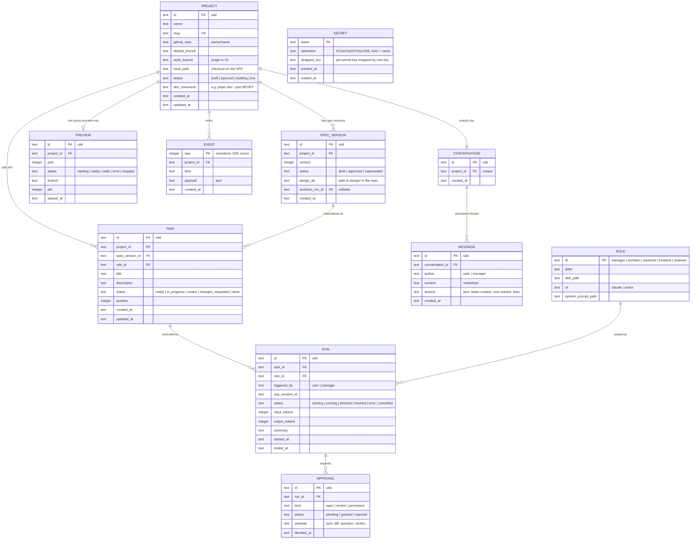
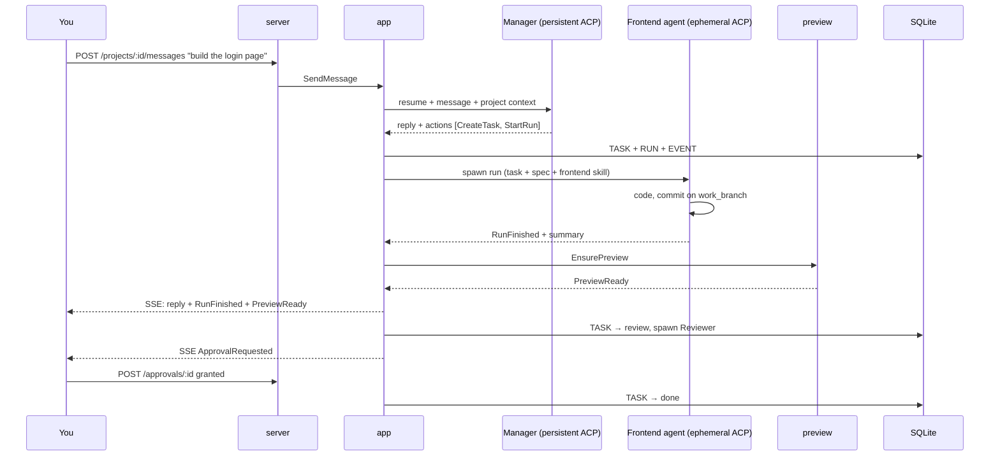

# LaToile — Architecture Specification

> **Date**: 2026-08-15
> **Status**: validated by the owner (Phases 1–4)
> **Origin**: app-architect-brainstorm session, Mode A (greenfield) informed by audits of Firetower, AionCore/AionUi, and IgnitionRAG.

## 1. Vision

**LaToile is an AI-native, single-user, self-hosted project workbench.** The central entity is the **project** — not the conversation (AionUi), not the detached session (Firetower). The user chats with a per-project **Manager** agent; the Manager turns discussion into specifications (via the Architect), tasks, and runs by executor agents (backend, frontend, reviewer). The application under construction renders live (web preview, mobile viewport first). Nothing merges without explicit human approval.

Name: la Toile (the Webway, WH40k) — the parallel network where agents work; also "la toile" = the web.

## 2. Structural decisions (locked)

| # | Decision | Rejected alternative |
|---|----------|----------------------|
| D1 | Single user first, self-hosted VPS, single token | Multi-tenant / SaaS — deferred; the model anticipates nothing beyond the token |
| D2 | **Selective** reuse of AionCore patterns | Hard fork — couples us to their release cadence and a 24-crate third-party codebase |
| D3 | Preview = web apps, mobile-first | All targets (mobile emulator, desktop) — out of V1 |
| D4 | Fixed roles: Manager, Architect, Backend, Frontend, Reviewer | Configurable teams — V2 |
| D5 | Single work branch per project (V1) | Branch-per-run + integration — real parallelism, V2 |
| D6 | Free chat only with the Manager; executors run structured tasks | Per-agent chat |
| D7 | HTML mockups = the Frontend agent's visual contract | Mockups as mere reference |
| D8 | Design artifacts live in the project repo (`design/`); the DB stores metadata only | Everything in the database — hides artifacts from git and agents |
| D9 | Token auth everywhere, preview included | Open preview |
| D10 | Preview auto-reloads when a frontend run finishes | Manual reload |
| D11 | UI internationalized from day one: French + English, message catalogs, no hardcoded strings; the Manager answers in the user's language | FR-only now, retrofit later — retrofitting i18n costs 10× more |

## 3. Domain model

### 3.1 Bounded contexts

| Context | Responsibility | Entities |
|---|---|---|
| Project | lifecycle, repo link, state | `Project` |
| Design | versioned spec, artifacts | `SpecVersion` |
| Orchestration | roles, tasks, runs, approvals | `Role`, `Task`, `Run`, `Approval` |
| Conversation | the Manager thread | `Conversation`, `Message` |
| Preview | dev server, port, state | `Preview` |
| Integrations | GitHub, skill catalog | (infrastructure clients) |
| Journal | events, SSE cursor | `Event` |
| Secrets | encrypted tokens | `Secret` |

### 3.2 Invariants

1. One active run per task (DB: partial unique index).
2. One active preview per project (same pattern).
3. One `approved` `SpecVersion` per project (same pattern).
4. `Task.status = done` requires a `granted` `Approval` of kind `review` — enforced by the domain state machine, not SQL.
5. An executor run carries: task + spec excerpts + role skill. Never free-form chat.
6. The preview always serves the declared `work_branch`; if it serves anything else, the UI reports `stale` — it never lies.
7. The Manager never receives dangerous permissions; it does not write code.

### 3.3 Domain events

`SpecVersionCreated/Approved` · `TaskReady` · `RunStarted/Blocked/Finished` · `ApprovalRequested/Granted/Rejected` · `PreviewReady/Stale/Error` · `MessagePosted` — all appended to `EVENT(seq, project_id, kind, payload)`; `seq` is the monotonic SSE cursor.

### 3.4 Roles (`ROLE` table, stable ids)

| id | Dedicated skill | Lifecycle | Output |
|----|----------------|-----------|--------|
| `manager` | project-manager skill (to be written) | persistent ACP session, resumed per message | messages + actions |
| `architect` | `app-architect-brainstorm` | ephemeral run | `SpecVersion` + `design/` files |
| `backend` | backend skill (to be written) | ephemeral run | commits + summary |
| `frontend` | frontend skill (to be written) | ephemeral run | commits + summary |
| `reviewer` | review skill (to be written) | ephemeral run | verdict → `Approval` |

## 4. Data model (ER)



Constraints: partial unique indexes for active run/task, active preview/project, approved spec/project. Audit fields everywhere. Soft delete only on `PROJECT` (`deleted_at`).

## 5. Architecture

### 5.1 Crates

```
crates/
├── core/      pure domain: entities, state machines, events, ports (traits). Zero I/O, zero async
├── agents/    ACP channel: supervised spawn, sessions, permissions, usage
├── preview/   dev-server supervision, port allocation, reverse proxy
├── github/    GitHub API client
├── vault/     secrets (XChaCha20-Poly1305, root key outside the DB)
├── app/       use cases: SendMessage, DispatchTask, GrantApproval, EnsurePreview…
├── server/    axum HTTP, SSE, embedded assets, token auth — extract, validate, delegate
└── cli/       binary: `latoile serve`, migrations at startup
web/           React + Vite + Tailwind, mobile-first, embedded via rust-embed
```

Graph: `core` at the center; `app` depends on `core` and the ports; `agents/preview/github/vault` implement the ports; `server` only talks to `app`; `cli` assembles. No upward dependencies.

### 5.2 Critical sequence



### 5.3 API contract (V1)

| Method | Route | Purpose |
|---|---|---|
| GET | `/api/projects`, `/api/projects/:id` | list / detail |
| POST | `/api/projects` | create + link repo |
| GET | `/api/github/repos` | repo picker |
| GET/POST | `/api/projects/:id/messages` | Manager thread |
| GET/PATCH | `/api/projects/:id/tasks` | board, reordering |
| POST | `/api/spec-versions/:id/approve` | approve a spec |
| GET | `/api/runs/:id` | detail (events, diff) |
| POST | `/api/approvals/:id` | `{granted\|rejected, comment}` |
| GET | `/api/projects/:id/preview/*` | dev-server reverse proxy (token required) |
| GET | `/api/events?after=<seq>` | SSE, cursor resume |
| GET | `/api/roles` | roles + skills |

Errors: `{code, message}`; internal error chains are never returned to the client (lesson V-H3 from the Firetower audit).

### 5.4 Screens (mobile-first)

1. **Inbox** — pending approvals + blocked runs
2. **Project** — Manager chat / task board / preview (mobile viewport default, desktop toggle)
3. **Review** (P0) — diff + reviewer verdict + **target mockup side-by-side with the render**
4. **New project** — pick repo → initial brief to the Manager

## 6. Stack decision record

| Layer | Choice | Rationale | Rejected |
|---|---|---|---|
| Backend language | Rust | official `agent-client-protocol` v2 crate, AionCore pattern reuse, prior Firetower experience | Bun/Hono — cuts off the crates, adds a runtime |
| HTTP | axum 0.8 | the choice of both reference codebases | actix |
| DB | SQLite + sqlx, embedded migrations | single-user self-hosted | Postgres — multi-tenant only |
| Frontend | React + Vite + Tailwind, embedded (rust-embed) | single binary, zero Node server | Next.js, Electron |
| Agent channel | `agent-client-protocol` crate + supervised spawn (aionui-process pattern) | structured status/permissions/cancel | tmux/PTY — documented debt |
| Preview | dev-server subprocess + axum reverse proxy + SSE reload | HMR traverses the proxy | containers — reserved for multi-tenant |
| GitHub | REST + encrypted token (vault) | proven pattern | OAuth device flow — matters for other users |
| Realtime | single SSE channel `/events` | sufficient for one user | bidirectional WebSocket |
| Style | modular monolith, Cargo workspace | team of one | microservices |

## 7. Risks

| Risk | Likelihood | Impact | Mitigation |
|---|---|---|---|
| ACP loses native CLI capabilities | Medium | Medium | direct claude/codex connectors possible later (AionCore precedent); the `agents/` port isolates the choice |
| Role skills must be written (manager, backend, frontend, reviewer) | Certain | Medium | separate workstream, starting with improving app-architect-brainstorm (Phase 4.6) |
| Two runs collide on the single branch | Medium | Medium | "one active run per task" invariant + sequential dispatch by default; D5 is reversible in V2 |
| Zombie dev servers on the VPS | Medium | Low | supervision + identity-gated orphan reaping (aionui-process pattern) |
| Scope creep toward SaaS | Medium | High | D1: anything multi-tenant is written out of scope |

## 8. Out of scope (written down, so it is not re-debated)

Multi-user and auth beyond the token · configurable teams · branch-per-run parallelism · emulator/desktop previews · direct chat with executor agents · containerized previews.

---
*Specification produced by app-architect-brainstorm. No source code generated.*
