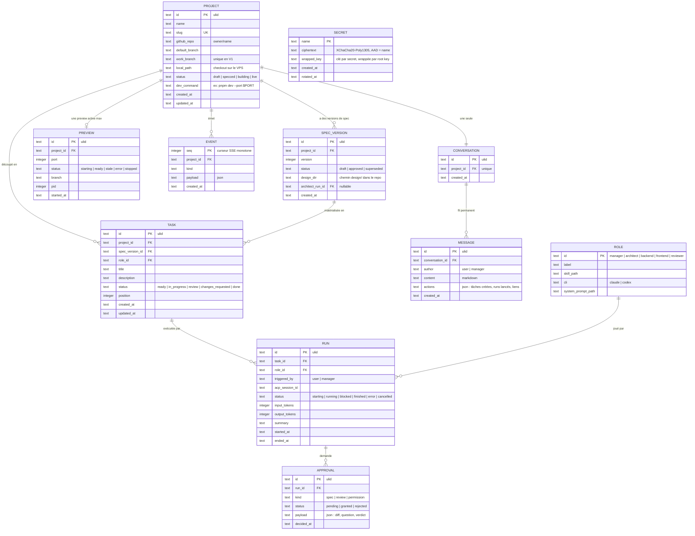
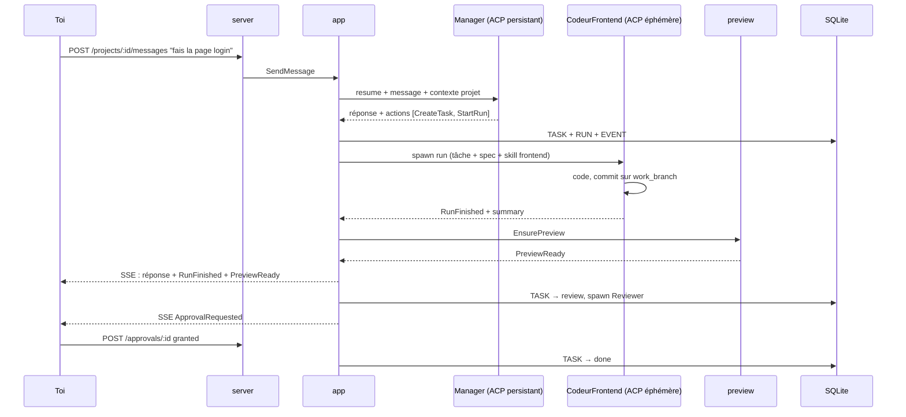

# LaToile — Spécification d'architecture

> **Date** : 2026-08-15
> **Statut** : validé par le propriétaire (Phases 1-4)
> **Origine** : session app-architect-brainstorm, Mode A (greenfield) éclairée par l'audit de Firetower et l'analyse d'AionCore/AionUi et IgnitionRAG.

## 1. Vision

**LaToile est un workbench de gestion de projet AI-native, mono-utilisateur, self-hosté.** L'unité centrale est le **projet**, pas la conversation (AionUi) ni la session détachée (Firetower). L'utilisateur discute avec un agent **Manager** par projet ; le Manager traduit la discussion en spécifications (via l'Architecte), en tâches, et en runs d'agents exécutants (backend, frontend, reviewer). Le rendu de l'application en construction est visible en direct (preview web, viewport mobile d'abord). Rien ne merge sans approbation humaine explicite.

Nom : la Toile (Webway, WH40k) — le réseau parallèle dans lequel les agents travaillent ; aussi « la toile » = le web.

## 2. Décisions structurantes (actées)

| # | Décision | Alternative rejetée |
|---|----------|---------------------|
| D1 | Mono-utilisateur d'abord, self-hosté VPS, token unique | Multi-tenant / SaaS — reporté, non anticipé dans le modèle au-delà du token |
| D2 | Réutilisation **sélective** des patterns AionCore | Fork dur — couplage à leur cadence, codebase tierce de 24 crates |
| D3 | Preview = apps web, mobile-first | Toutes cibles (mobile émulateur, desktop) — hors V1 |
| D4 | Rôles fixes : Manager, Architecte, Backend, Frontend, Reviewer | Équipes configurables — V2 |
| D5 | Branche de travail unique par projet (V1) | Branche par run + intégration — vrai parallélisme, V2 |
| D6 | Chat libre uniquement avec le Manager ; exécutants = runs structurés | Chat avec chaque agent |
| D7 | Maquettes HTML = contrat visuel du CodeurFrontend | Maquettes comme simple référence |
| D8 | Artefacts de design dans le repo du projet (`design/`), métadonnées en DB | Tout en base — rend les artefacts invisibles à git et aux agents |
| D9 | Auth par token partout, preview incluse | Preview ouverte |
| D10 | Preview auto-rechargée à la fin d'un run frontend | Rechargement manuel |

## 3. Modèle de domaine

### 3.1 Bounded contexts

| Contexte | Responsabilité | Entités |
|---|---|---|
| Projet | cycle de vie, lien repo, état | `Project` |
| Design | spec versionnée, artefacts | `SpecVersion` |
| Orchestration | rôles, tâches, runs, approbations | `Role`, `Task`, `Run`, `Approval` |
| Conversation | le fil Manager | `Conversation`, `Message` |
| Preview | dev server, port, état | `Preview` |
| Intégrations | GitHub, catalogue de skills | (clients infrastructure) |
| Journal | événements, curseur SSE | `Event` |
| Secrets | tokens chiffrés | `Secret` |

### 3.2 Invariants

1. Un seul run actif par tâche (contrainte DB : index unique partiel).
2. Une seule preview active par projet (idem).
3. Une seule `SpecVersion` `approved` par projet (idem).
4. `Task.status = done` exige une `Approval` `granted` de kind `review` — machine à états du domaine, pas le SQL.
5. Un run exécutant porte : tâche + extraits de spec + skill du rôle. Jamais de chat libre.
6. La preview sert toujours la `work_branch` déclarée ; si elle sert autre chose, l'UI l'affiche (`stale`).
7. Le Manager ne reçoit jamais de permission dangereuse ; il ne code pas.

### 3.3 Événements domaine

`SpecVersionCreated/Approved` · `TaskReady` · `RunStarted/Blocked/Finished` · `ApprovalRequested/Granted/Rejected` · `PreviewReady/Stale/Error` · `MessagePosted` — tous appendés dans `EVENT(seq, project_id, kind, payload)`, curseur SSE monotone.

### 3.4 Rôles (table `ROLE`, ids stables)

| id | Skill dédié | Mode de vie | Sortie |
|----|------------|-------------|--------|
| `manager` | skill chef-de-projet (à écrire) | session ACP persistante, resume par message | messages + actions |
| `architect` | `app-architect-brainstorm` | run éphémère | `SpecVersion` + fichiers `design/` |
| `backend` | skill backend (à écrire) | run éphémère | commits + summary |
| `frontend` | skill frontend (à écrire) | run éphémère | commits + summary |
| `reviewer` | skill review (à écrire) | run éphémère | verdict → `Approval` |

## 4. Modèle de données (ER)



Contraintes : index uniques partiels sur runs actifs/tâche, previews actives/projet, spec approved/projet. Audit fields partout. Soft delete uniquement sur `PROJECT` (`deleted_at`).

## 5. Architecture

### 5.1 Crates

```
crates/
├── core/      domaine pur : entités, machines à états, événements, ports (traits). Zéro I/O, zéro async
├── agents/    canal ACP : spawn supervisé, sessions, permissions, usage
├── preview/   supervision dev server, allocation de ports, reverse proxy
├── github/    client API GitHub
├── vault/     secrets (XChaCha20-Poly1305, root key hors DB)
├── app/       use cases : SendMessage, DispatchTask, GrantApproval, EnsurePreview…
├── server/    HTTP axum, SSE, assets embarqués, auth token — extraire, valider, déléguer
└── cli/       binaire : `latoile serve`, migrations au démarrage
web/           React + Vite + Tailwind, mobile-first, embarqué via rust-embed
```

Graphe : `core` au centre ; `app` dépend de `core` et des ports ; `agents/preview/github/vault` implémentent les ports ; `server` ne parle qu'à `app` ; `cli` assemble. Aucune dépendance remontante.

### 5.2 Séquence critique



### 5.3 Contrat API (V1)

| Méthode | Route | Rôle |
|---|---|---|
| GET | `/api/projects`, `/api/projects/:id` | liste / détail |
| POST | `/api/projects` | créer + lier repo |
| GET | `/api/github/repos` | picker de repo |
| GET/POST | `/api/projects/:id/messages` | fil Manager |
| GET/PATCH | `/api/projects/:id/tasks` | board, réordonnancement |
| POST | `/api/spec-versions/:id/approve` | valider une spec |
| GET | `/api/runs/:id` | détail (événements, diff) |
| POST | `/api/approvals/:id` | `{granted\|rejected, comment}` |
| GET | `/api/projects/:id/preview/*` | reverse proxy dev server (token requis) |
| GET | `/api/events?after=<seq>` | SSE, reprise par curseur |
| GET | `/api/roles` | rôles + skills |

Erreurs : `{code, message}` ; jamais de chaîne interne renvoyée au client (leçon V-H3 de l'audit Firetower).

### 5.4 Écrans (mobile-first)

1. **Inbox** — approvals pending + runs bloqués
2. **Projet** — chat Manager / board tâches / preview (viewport mobile par défaut, toggle desktop)
3. **Review** (P0) — diff + verdict reviewer + **maquette cible côte à côte du rendu**
4. **Nouveau projet** — pick repo → brief initial au Manager

## 6. Stack Decision Record

| Couche | Choix | Justification | Rejeté |
|---|---|---|---|
| Langage backend | Rust | crate officielle `agent-client-protocol` v2, réutilisation patterns AionCore, expérience Firetower | Bun/Hono — coupe des crates, runtime en plus |
| HTTP | axum 0.8 | choix des deux références | actix |
| DB | SQLite + sqlx, migrations embarquées | mono-utilisateur self-hosté | Postgres — multi-tenant seulement |
| Frontend | React + Vite + Tailwind, embarqué (rust-embed) | binaire unique, zéro serveur Node | Next.js, Electron |
| Canal agents | crate `agent-client-protocol` + spawn supervisé (pattern aionui-process) | statut/permissions/cancel structurés | tmux/PTY — dette documentée |
| Preview | subprocess dev server + reverse proxy axum + SSE reload | HMR traverse le proxy | conteneurs — réservé multi-tenant |
| GitHub | REST + token chiffré (vault) | éprouvé | OAuth device-flow — utile aux autres utilisateurs |
| Temps réel | SSE `/events` mono-canal | suffisant solo | WS bidirectionnel |
| Style | monolithe modulaire, workspace Cargo | équipe de 1 | microservices |

## 7. Risques

| Risque | Prob. | Impact | Mitigation |
|---|---|---|---|
| ACP perd des capacités natives des CLIs | Moyenne | Moyen | connecteurs directs claude/codex possibles plus tard (precedent AionCore) ; le port `agents/` isole le choix |
| Skills rôles à écrire (manager, backend, frontend, reviewer) | Certaine | Moyen | chantier séparé, commence par améliorer app-architect-brainstorm (Phase 4.6) |
| Deux runs se marchent dessus sur la branche unique | Moyenne | Moyen | invariant « un run actif par tâche » + dispatch séquentiel par défaut ; D5 réversible en V2 |
| Dev servers zombies sur le VPS | Moyenne | Faible | supervision + reap par identité de processus (pattern aionui-process) |
| Scope creep vers le SaaS | Moyenne | Élevé | D1 : tout multi-tenant est hors périmètre écrit |

## 8. Hors périmètre (écrit, pour ne pas re-débattre)

Multi-utilisateurs et auth au-delà du token · équipes configurables · branche par run et parallélisme · preview mobile émulateur/desktop · chat direct avec les exécutants · conteneurisation des previews.

---
*Spécification produite par app-architect-brainstorm. Aucun code source généré.*
