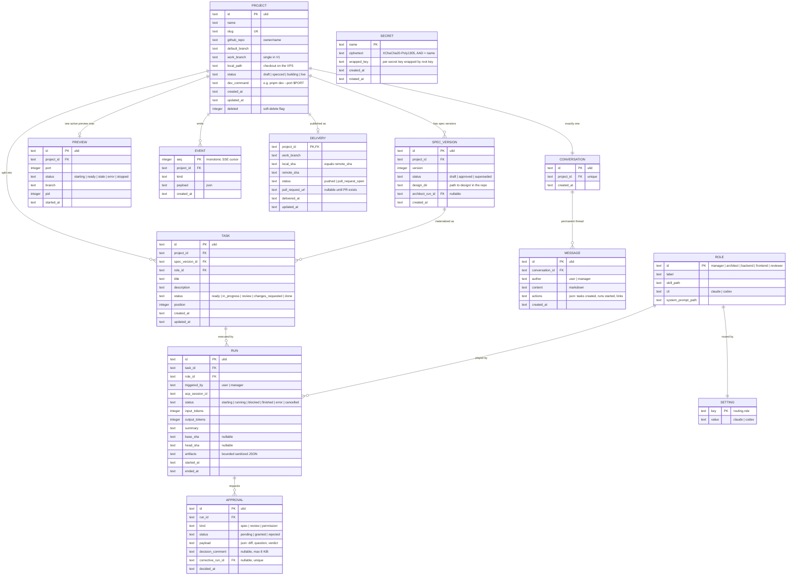

# LaToile — Architecture Specification

> **Date**: 2026-08-15
> **Status**: V1 implemented; full Codex ACP vertical slice verified on 2026-08-18
> **Origin**: app-architect-brainstorm session, Mode A (greenfield) informed by audits of Firetower, AionCore/AionUi, and IgnitionRAG.

## 1. Vision

**LaToile is an AI-native, single-user, self-hosted project workbench.** The central entity is the **project** — not the conversation (AionUi), not the detached session (Firetower). The user chats with a per-project **Manager** agent; the Manager turns discussion into specifications (via the Architect), tasks, and runs by executor agents (backend, frontend, reviewer). The application under construction renders live (web preview, mobile viewport first). Nothing merges without explicit human approval.

Name: la Toile (the Webway, WH40k) — the parallel network where agents work; also "la toile" = the web.

## 2. Structural decisions (locked)

| # | Decision | Rejected alternative |
|---|----------|----------------------|
| D1 | Single user first, self-hosted VPS, single token | Multi-tenant / SaaS — deferred; the model anticipates nothing beyond the token |
| D2 | **Selective** reuse of AionCore patterns | Hard fork — couples us to their release cadence and a 24-crate third-party codebase |
| D3 | Preview = web apps, mobile-first | All targets (mobile emulator, desktop) — out of V1 |
| D4 | Fixed roles: Manager, Architect, Backend, Frontend, Reviewer | Configurable teams — V2 |
| D5 | Single work branch per project (V1) | Branch-per-run + integration — real parallelism, V2 |
| D6 | Free chat only with the Manager; executors run structured tasks | Per-agent chat |
| D7 | HTML mockups = the Frontend agent's visual contract | Mockups as mere reference |
| D8 | Design artifacts live in the project repo (`design/`); the DB stores metadata only | Everything in the database — hides artifacts from git and agents |
| D9 | Token auth on every product route, preview included; only `/api/health` is open | Open preview |
| D10 | Preview auto-reloads when a frontend run finishes | Manual reload |
| D11 | UI internationalized from day one: French + English, message catalogs, no hardcoded strings; the Manager answers in the user's language | FR-only now, retrofit later — retrofitting i18n costs 10× more |
| D12 | An executor is reviewed by the dedicated Reviewer before the owner sees a review decision | Ask the owner to inspect every executor result directly |
| D13 | Mutating ACP requests block the run and require an exact, one-shot owner decision; hard denials are never grantable | Trust the agent prompt or auto-allow all workspace tools |
| D14 | Delivery is an explicit owner action: verify approved SHAs, push without force, verify the remote SHA, then find or create a PR; never merge | Push automatically when a run finishes or merge through the application |

## 3. Domain model

### 3.1 Bounded contexts

| Context | Responsibility | Entities |
|---|---|---|
| Project | lifecycle, repo link, state | `Project` |
| Design | versioned spec, artifacts | `SpecVersion` |
| Orchestration | roles, tasks, runs, approvals | `Role`, `Task`, `Run`, `Approval` |
| Conversation | the Manager thread | `Conversation`, `Message` |
| Preview | dev server, port, state | `Preview` |
| Delivery | verified work-branch publication | `Delivery` |
| Integrations | GitHub, provider CLIs, skill catalog | (infrastructure clients) |
| Journal | events, SSE cursor | `Event` |
| Secrets | encrypted tokens | `Secret` |

### 3.2 Invariants

1. One active run per task (DB: partial unique index).
2. One active preview per project (same pattern).
3. One `approved` `SpecVersion` per project (same pattern).
4. `Task.status = done` requires a `granted` `Approval` of kind `review` — enforced by the domain state machine, not SQL.
5. An executor run carries: task + spec excerpts + role skill. Never free-form chat.
6. The preview starts in the canonical project checkout and records the declared
   `work_branch`. V1 refreshes/recycles the process after executor completion;
   delivery performs the exact current-branch check before publication.
7. The Manager never receives dangerous permissions; it does not write code.
8. Every fixed role has one persisted provider assignment (`claude` or
   `codex`). A change affects the next fresh executor session; changing the
   Manager provider evicts its persistent session before the next message.
9. A new run receives its `ProjectId` explicitly at the agent port. Its task
   and run rows are persisted only after the ACP handshake succeeds, so a
   failed spawn leaves no active database ghost.
10. A terminal executor run stores only bounded, sanitized evidence:
    `base_sha`, `head_sha`, activity classes, commits, changed paths and diff
    statistics. Raw tool input and hidden reasoning never enter SQLite.
11. A mutating executor tool request parks the exact run and creates one
    permission approval. Timeout, cancellation and restart reject it
    fail-closed. The Manager cannot receive mutating permissions; `.env`,
    Docker and paths outside the project checkout are hard-denied.
12. Delivery requires every selected task to be `done` through a granted
    Reviewer decision, no pending approval or active run, a clean checkout on
    the stored work branch, and every approved executor SHA to be an ancestor
    of the pushed HEAD. `local_sha = remote_sha` is a domain and SQL invariant.

### 3.3 Domain events

`SpecVersionCreated/Approved` · `TaskReady` · `RunStarted/Blocked/Finished` · `ApprovalRequested/Granted/Rejected` · `PreviewReady/Stale/Error` · `MessagePosted` — all appended to `EVENT(seq, project_id, kind, payload)`; `seq` is the monotonic SSE cursor.

### 3.4 Roles (`ROLE` table, stable ids)

| id | Dedicated skill | Lifecycle | Output |
|----|----------------|-----------|--------|
| `manager` | `project-manager` | persistent ACP session, resumed per message | messages + executable action block |
| `architect` | `app-architect-brainstorm` | ephemeral run | `SpecVersion` + `design/` files |
| `backend` | `backend-engineer` | ephemeral ACP run | commits + sanitized evidence |
| `frontend` | `frontend-engineer` | ephemeral ACP run | commits + sanitized evidence |
| `reviewer` | `code-reviewer` | ephemeral ACP run | structured verdict → human `Approval` |

## 4. Data model (ER)



Constraints: partial unique indexes for active run/task, active preview/project and approved spec/project; one corrective run per rejected approval; one delivery per project; delivery SHA equality and PR URL/status consistency. Soft delete is the `PROJECT.deleted` flag. Migrations are append-only (`0001` through `0005` at the V1 canary).

## 5. Architecture

### 5.1 Crates

```
crates/
├── core/      pure domain: entities, state machines, events, dependency-free async ports
├── agents/    ACP channel + provider CLI auth: supervised spawn, sessions, permissions, usage
├── preview/   dev-server supervision, port allocation, reverse proxy
├── github/    checkout provisioning, Git verification/push, GitHub REST/PR client
├── vault/     secrets (XChaCha20-Poly1305, root key outside the DB)
├── app/       use cases + supervision decisions: messages, dispatch, review, permissions, delivery
├── server/    axum HTTP, SSE, embedded assets, token auth — extract, validate, delegate
└── cli/       binary: `latoile serve`, migrations at startup
web/           React + Vite + Tailwind, mobile-first, embedded via rust-embed
```

Graph: `core` at the center; `app` depends on `core` and the ports; `agents/preview/github/vault` implement the ports; `server` only talks to `app`; `cli` assembles. No upward dependencies.

### 5.2 Critical sequence

```mermaid
sequenceDiagram
    participant You
    participant S as server
    participant A as app
    participant M as Manager (persistent ACP)
    participant F as Frontend agent (ephemeral ACP)
    participant R as Reviewer (ephemeral ACP)
    participant P as preview
    participant G as GitHub
    participant DB as SQLite

    You->>S: POST /projects/:id/messages "build the login page"
    S->>A: SendMessage
    A->>M: skill preamble + message (persistent session history)
    M-->>A: reply + latoile-actions
    A->>F: ACP handshake (ProjectId + task + spec + skill)
    A->>DB: persist TASK + RUN + EVENT after handshake
    opt mutating ACP tool
        F-->>A: sanitized permission request
        A->>DB: RUN blocked + permission APPROVAL
        You->>S: grant or reject exact permission
        S->>A: resolve once; RUN resumes
    end
    F->>F: code, commit on work_branch
    F-->>A: terminal result + bounded Git evidence
    A->>DB: RUN finished + TASK → review
    A->>P: EnsurePreview
    P-->>A: PreviewReady
    A->>R: task + approved spec + visual contract + Git evidence
    R-->>A: structured latoile-review verdict
    A->>DB: reviewer RUN finished + review APPROVAL requested
    A-->>You: SSE ApprovalRequested (Reviewer evidence attached)
    You->>S: POST /approvals/:id granted
    A->>DB: TASK → done
    You->>S: POST /projects/:id/delivery
    A->>G: verify clean branch + approved SHA ancestry; push non-force
    G-->>A: remote SHA
    A->>DB: DELIVERY pushed (local_sha = remote_sha)
    A->>G: find existing PR or create one
    G-->>A: Pull Request URL
    A->>DB: DELIVERY → pull_request_open
    Note over A,G: LaToile never merges
```

### 5.3 API contract (V1)

| Method | Route | Purpose |
|---|---|---|
| GET | `/api/health` | unauthenticated health check; the only open route |
| GET | `/api/projects`, `/api/projects/:id` | list / detail |
| POST | `/api/projects` | validate identity, clone/fetch repo, detect default branch, create work branch |
| GET/POST | `/api/projects/:id/delivery` | read delivery evidence / explicit verified push + PR action |
| GET | `/api/github/repos` | repo picker |
| GET/POST | `/api/projects/:id/messages` | Manager thread |
| GET/POST | `/api/projects/:id/tasks` | board / explicit executor dispatch |
| PATCH | `/api/projects/:id/tasks/:task_id` | reorder one task |
| GET | `/api/projects/:id/spec-versions` | list draft, approved and superseded specs |
| POST | `/api/spec-versions/:id/approve` | approve a spec |
| GET | `/api/runs/:id` | status, summary, base/head SHA and sanitized artifacts |
| GET | `/api/approvals`, `/api/approvals/:id` | pending inbox / decision detail |
| POST | `/api/approvals/:id` | `{granted: bool, comment?: string}` for review or permission |
| GET/POST/DELETE | `/api/projects/:id/preview` | status / ensure / stop supervised dev server |
| any | `/api/projects/:id/preview/*` | token-gated streaming reverse proxy |
| GET | `/api/events?after=<seq>` | SSE, cursor resume |
| GET | `/api/roles` | roles + skills |
| GET/PUT | `/api/settings/routing` | role → provider assignments |
| GET | `/api/agent-auth/status` | Claude and Codex CLI login status |
| POST | `/api/agent-auth/start` | start a provider login challenge |
| GET | `/api/agent-auth/:id` | poll a login challenge |
| POST | `/api/agent-auth/:id/code` | submit Claude's authorization code |
| POST | `/api/agent-auth/disconnect` | log out through the provider CLI |

Errors: `{code, message}`; domain refusals use 422, wrong-state conflicts use 409, and internal adapter/store chains never leave `tracing`. All routes except health require the bearer token; a query token is accepted only on preview proxy paths for the iframe.

### 5.4 Screens (mobile-first)

1. **Inbox** — pending approvals + blocked runs
2. **Project** — Manager chat / task board / preview (mobile viewport default, desktop toggle)
3. **Review** (P0) — verdict, findings, diff excerpt and structured spec/render comparison supplied by the Reviewer
4. **New project** — pick repo → initial brief to the Manager
5. **Settings** — provider connections + fixed-role provider routing

## 6. Stack decision record

| Layer | Choice | Rationale | Rejected |
|---|---|---|---|
| Backend language | Rust | official `agent-client-protocol` v2 crate, AionCore pattern reuse, prior Firetower experience | Bun/Hono — cuts off the crates, adds a runtime |
| HTTP | axum 0.8 | the choice of both reference codebases | actix |
| DB | SQLite + sqlx, embedded migrations | single-user self-hosted | Postgres — multi-tenant only |
| Frontend | React + Vite + Tailwind, embedded (rust-embed) | single binary, zero Node server | Next.js, Electron |
| Agent channel | `agent-client-protocol` crate + supervised spawn (aionui-process pattern) | structured status/permissions/cancel | tmux/PTY — documented debt |
| Preview | dev-server subprocess + axum HTTP reverse proxy + supervised refresh | same-origin iframe and stable project URL; WebSocket upgrade is deferred | containers — reserved for multi-tenant |
| GitHub | REST + encrypted token (vault) | proven pattern | OAuth device flow — matters for other users |
| Realtime | single SSE channel `/events` | sufficient for one user | bidirectional WebSocket |
| Style | modular monolith, Cargo workspace | team of one | microservices |

## 7. Risks

| Risk | Likelihood | Impact | Mitigation |
|---|---|---|---|
| ACP loses native CLI capabilities | Medium | Medium | direct claude/codex connectors possible later (AionCore precedent); the `agents/` port isolates the choice |
| ACP adapter or provider CLI drift breaks a real session | Medium | High | native CLI status checks, actionable handshake errors, hermetic connector tests and the opt-in vertical canary |
| Two runs collide on the single branch | Medium | Medium | "one active run per task" invariant + sequential dispatch by default; D5 is reversible in V2 |
| Zombie dev servers on the VPS | Medium | Low | dedicated process groups, `kill_on_drop`, bounded readiness and explicit preview stop |
| A PR publishes unreviewed or different code | Low | High | granted Reviewer decisions, executor SHA ancestry checks, clean branch/origin checks and exact post-push remote verification |
| Scope creep toward SaaS | Medium | High | D1: anything multi-tenant is written out of scope |

### 7.1 Verified V1 limits

The real-provider canary proves the documented vertical slice with a
pre-existing `design/` contract. It does not erase these current limits:

- The Manager receives its persistent conversation plus the current user
  message, not a freshly assembled task/run/approval context payload on every
  turn.
- `propose_spec` registers spec metadata; the automatic initial Architect run
  that creates and commits a greenfield `design/` package is not wired. The
  approved-directory-to-commit link remains a workflow rule (ADR-003).
- Project status reaches `specced`; automatic promotion to `building` and
  `live` is not yet connected to orchestration/deployment events.
- Preview proxying streams HTTP bodies but not WebSocket upgrades. Executor
  completion recycles the supervised preview; Vite-style WebSocket HMR through
  the proxy is outside V1.
- The Review comparison is bounded structured Reviewer evidence, not a
  screenshot or pixel-diff engine.
- Delivery publishes the complete clean work branch. It does not select tasks,
  merge, deploy or monitor production.

## 8. Out of scope (written down, so it is not re-debated)

Multi-user and auth beyond the token · configurable teams · branch-per-run parallelism · emulator/desktop previews · direct chat with executor agents · containerized previews · WebSocket preview upgrades · automatic merge.

---
*Initial specification produced by app-architect-brainstorm; updated against the shipped code and V1 canary evidence.*
