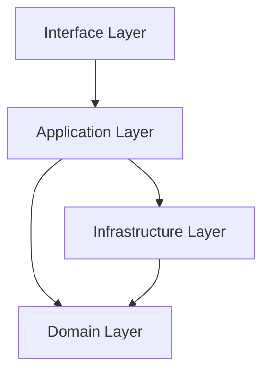
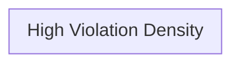

# Architecture Audit: {PROJECT_NAME}

> **Audit Date**: {DATE}
> **Auditor**: Agent + Developer
> **Mode**: Reverse Engineering (Mode B)
> **Archetype**: {WEB_APP | API | MOBILE | ML | CLI | REALTIME | DESKTOP | PIPELINE}

---

## 1. Executive Summary

**Architecture Pattern Detected**: {LAYERED | MVC | BIG_BALL_OF_MUD | FRAMEWORK_DRIVEN | HYBRID}

**Overall Health**: {HEALTHY | DEGRADED | CRITICAL} — X violations detected (Y critical, Z high)

**One-sentence assessment**: {Describe the single biggest architectural concern}

---

## 2. Project Profile

| Attribute | Value |
|-----------|-------|
| Language(s) | ... |
| Framework | ... |
| Database | ... |
| ORM/Query Builder | ... |
| Lines of Code | ... |
| Test Coverage | ...% |
| Dependencies | ... direct, ... dev |
| Entry Point(s) | ... |
| Authentication | ... |
| Deployment | ... |

---

## 3. Current Structure

```
{Actual folder tree from the codebase}
```

### Structure Assessment

| Pattern Detected | Confidence | Evidence |
|------------------|------------|----------|
| {e.g., MVC} | {High/Medium/Low} | {observation} |

---

## 4. Layer Mapping

### 4.1 Clean Architecture Layer Assignment

| File | Current Location | Assigned Clean Layer | Status | Notes |
|------|-----------------|---------------------|--------|-------|
| `...` | `src/...` | `domain/entities/` | {CORRECT / MISPLACED / VIOLATION} | ... |

### 4.2 Layer Coherence Score

| Layer | Files Assigned | Correctly Placed | Score |
|-------|---------------|-----------------|-------|
| Domain | X | Y | Y/X% |
| Application | X | Y | Y/X% |
| Infrastructure | X | Y | Y/X% |
| Interface | X | Y | Y/X% |

---

## 5. Violation Register

### 5.1 Critical Violations (Fix First)

| ID | Violation Type | Files Affected | Severity | Effort | Priority |
|----|---------------|---------------|----------|--------|----------|
| V1 | ... | ... | CRITICAL | ...h | P0 |

### 5.2 High Severity (Fix Soon)

| ID | Violation Type | Files Affected | Severity | Effort | Priority |
|----|---------------|---------------|----------|--------|----------|
| H1 | ... | ... | HIGH | ...h | P1 |

### 5.3 Medium/Low (Opportunistic)

| ID | Violation Type | Files Affected | Severity | Effort | Priority |
|----|---------------|---------------|----------|--------|----------|
| M1 | ... | ... | MEDIUM | ...h | P2 |

---

## 6. Architecture Diagrams

### 6.1 Current Layer Structure (AS-IS)



### 6.2 Import Dependency Graph

```mermaid
graph LR
    %% Show key import relationships and cycles
```

### 6.3 Violation Heatmap



---

## 7. Risk Assessment

| Risk | Likelihood | Impact | Description | Mitigation |
|------|-----------|--------|-------------|------------|
| ... | {High/Med/Low} | {High/Med/Low} | ... | ... |

---

## 8. Migration Roadmap

### 8.1 Target Architecture

```
src/
├── domain/
│   ├── entities/
│   ├── value-objects/
│   ├── repositories/
│   ├── events/
│   └── services/
├── application/
│   ├── use-cases/
│   ├── dto/
│   └── ports/
├── infrastructure/
│   ├── persistence/
│   ├── cache/
│   ├── external/
│   └── config/
└── interface/
    ├── http/
    ├── middleware/
    └── validators/
```

### 8.2 Migration Phases

| Phase | Focus | Duration | Deliverables | Success Criteria |
|-------|-------|----------|--------------|-----------------|
| 1 | Domain Foundation | Week 1-2 | Pure entities, value objects | Zero ORM in domain |
| 2 | Repository Abstraction | Week 2-3 | Interfaces + implementations | All DB access through repos |
| 3 | Use Case Extraction | Week 3-4 | One use case per user story | Handlers only delegate |
| 4 | Interface Cleanup | Week 4-5 | Validators, middleware | No business logic in interface |
| 5 | Testing & Hardening | Week 5-6 | Unit + integration tests | >X% coverage, guardian passes |

### 8.3 Quick Wins (Immediate)

1. {Quick win — low effort, high value}
2. {Quick win}

### 8.4 Big Rocks (Dedicated Effort)

1. {Major refactoring}
2. {Major refactoring}

---

## 9. Architecture Contract (TO-BE)

```markdown
{Paste generated ARCHITECTURE_CONTRACT.md here}
```

---

## 10. Guardian Checklist

| Check | Verify With | Pass/Fail |
|-------|-------------|-----------|
| No ORM imports in domain/ | `grep -r "{ORM_PATTERN}" src/domain/` | ... |
| Repository interfaces exist | `ls src/domain/repositories/` | ... |
| No HTTP types in domain/ | `grep -r "Request\|Response" src/domain/` | ... |
| Mappers exist per repo | `ls src/infrastructure/persistence/mappers/` | ... |
| Use cases in application/ | `ls src/application/use-cases/` | ... |
| Handlers only delegate | `grep -r "prisma\.\|db\." src/interface/` | ... |
| Config centralized | `grep -r "localhost\|secret" src/ --include="*.ts" | grep -v "\.env\|config"` | ... |
| Entities have behavior | Check entity files for methods beyond getters | ... |
| DI used everywhere | `grep -r "new .*Repository\|new .*Service" src/` | ... |
| Tests exist | `find src -name "*.test.*" -o -name "*.spec.*" | wc -l` | ... |

---

*Generated by app-architect-brainstorm skill — Mode B: Reverse Engineering*
*This is a specification document. No source code was generated.*
