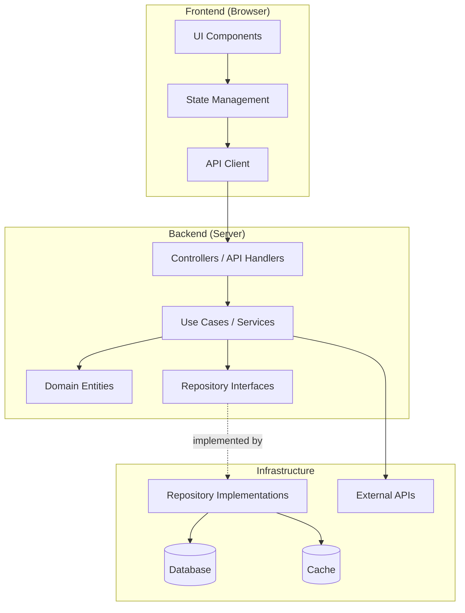
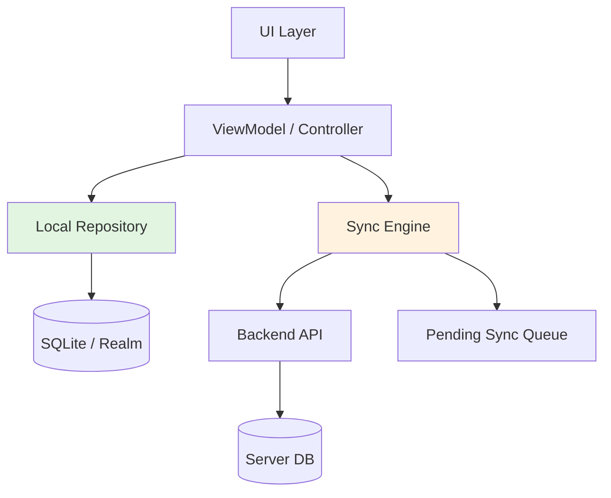
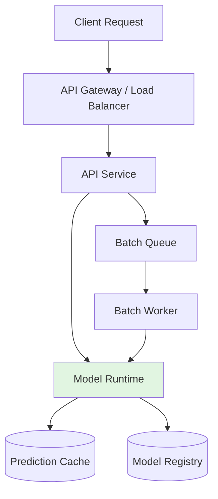
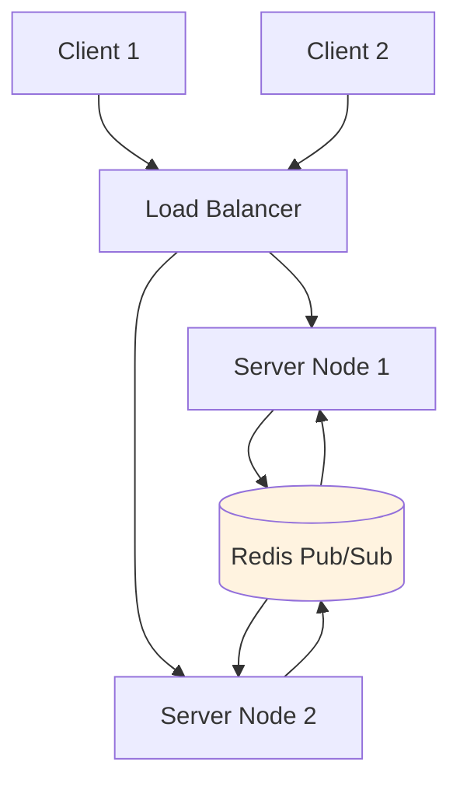
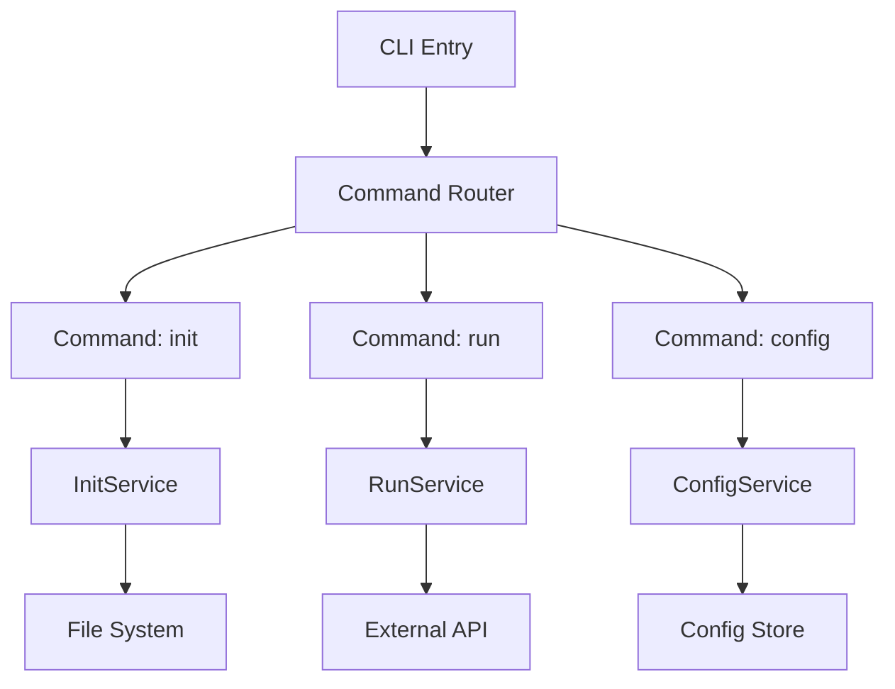

# Architecture Patterns by Product Archetype

## Table of Contents
1. [Universal Patterns (All Archetypes)](#universal)
2. [Web Application](#web-app)
3. [Mobile Application](#mobile)
4. [API-Only Service](#api-only)
5. [ML / Inference API](#ml-inference)
6. [Real-Time System](#real-time)
7. [CLI Tool](#cli)
8. [Desktop Application](#desktop)
9. [Data Pipeline](#data-pipeline)
10. [Cross-Cutting Concerns](#cross-cutting)

---

## Universal Patterns

### Layered Architecture (All Archetypes)

Every system, regardless of type, benefits from clear layering:

```
┌─────────────────────────────────────────┐
│  Interface Layer (entry points)         │  HTTP handlers, CLI commands, WS handlers, consumers
├─────────────────────────────────────────┤
│  Application Layer (orchestration)      │  Use cases, DTOs, application services
├─────────────────────────────────────────┤
│  Domain Layer (business logic)          │  Entities, value objects, domain services, invariants
├─────────────────────────────────────────┤
│  Infrastructure Layer (adapters)        │  DB repos, external APIs, message queues, cache
└─────────────────────────────────────────┘
         ↑ Dependencies point INWARD only
```

### The Repository Pattern (All Archetypes)

**Port** (defined in Domain layer):
```
interface OrderRepository:
  findById(id): Order | null
  findByCustomer(customerId): Order[]
  save(order): Order
  delete(id): void
```

**Adapter** (implemented in Infrastructure layer):
- PostgreSQL → SQL queries, ORM
- MongoDB → Document queries
- In-memory → HashMap (for testing)
- File system → JSON/CSV files

### Testing Strategy (All Archetypes)

| Test Type | Scope | Dependencies | Speed | Coverage Target |
|-----------|-------|-------------|-------|-----------------|
| Unit | Domain entities, pure functions | None | < 10ms | Business logic |
| Integration | Repositories, external APIs | Dockerized DB/services | < 500ms | Adapter correctness |
| Contract | API request/response | Mock server or consumer | < 1s | API compatibility |
| E2E | Full user flow | Full system | < 10s | Critical paths |

---

## Web Application

### Fullstack Architecture



### Frontend Patterns

**State Management Decision**:
- Local component state only → `useState` / signals (< 5 shared states)
- Shared UI state → Lightweight store (Zustand, Pinia, Context)
- Server state → TanStack Query / SWR / RTK Query (caching, deduping, background refresh)
- Complex global → Store with actions (Redux, NgRx) only if justified

**Component Architecture**:
- Feature-based folders: `features/orders/`, `features/products/`
- Each feature: `components/`, `hooks/`, `services/`, `types.ts`
- Shared: `shared/components/` (Button, Input, Modal), `shared/utils/`, `shared/api/`

### Backend Patterns

**API Design**:
- REST for CRUD (caching friendly, simple)
- GraphQL when clients need flexible queries
- tRPC for TypeScript fullstack (end-to-end type safety)
- Always version: `/api/v1/...`

**Folder Structure** (example — adapts to language):
```
backend/
├── domain/
│   ├── entities/           # User, Order, Product — pure logic
│   ├── value-objects/      # Email, Money, Address — validated
│   ├── repositories/       # OrderRepository (interface)
│   └── events/             # OrderCreated, PaymentReceived
├── application/
│   ├── use-cases/          # CreateOrder, CancelOrder
│   ├── dto/                # CreateOrderRequest, OrderResponse
│   └── services/           # EmailService (port), PaymentGateway (port)
├── infrastructure/
│   ├── persistence/        # PostgreSQLOrderRepository
│   ├── cache/              # RedisCache
│   ├── email/              # SendGridEmailService
│   └── http/               # StripePaymentGateway
└── interface/
    ├── http/               # OrderController, middleware
    ├── validators/         # Request validation
    └── middleware/         # Auth, logging, rate limiting
```

---

## Mobile Application

### Offline-First Architecture

Mobile apps must work without network. Architecture:



**Patterns**:
- **Optimistic UI**: Update local DB immediately, sync in background
- **Conflict resolution**: Last-write-wins, merge strategy, or server-authoritative
- **Sync queue**: Queue mutations, retry with exponential backoff
- **Local caching**: Full offline read capability

### Cross-Platform Decision

| Factor | Flutter | React Native | Kotlin Multiplatform | Native (Swift/Kotlin) |
|--------|---------|-------------|---------------------|----------------------|
| UI customization | High | Medium | Platform native | Full |
| Performance | Near-native | Good | Native | Best |
| Code sharing | 90%+ | 80%+ | 70-80% (business logic) | 0% |
| Team size (efficient) | 1-2 | 2-3 | 3-4 | 4+ (2 per platform) |
| Ecosystem | Large | Massive | Growing | Platform-specific |

---

## API-Only Service

### Design Principles

1. **Contract-first**: Define OpenAPI spec before implementation
2. **Version in URL**: `/api/v1/...`, `/api/v2/...`
3. **Consistent errors**: RFC 7807 Problem Details
4. **Pagination everywhere**: Cursor for real-time, offset for admin
5. **Idempotency keys**: For mutating operations (`Idempotency-Key` header)
6. **Rate limiting**: Per-client bucket (Redis-backed)

### Endpoint Structure

```
GET    /api/v1/{resource}          → List (paginated)
GET    /api/v1/{resource}/{id}     → Get one
POST   /api/v1/{resource}          → Create (returns 201 + Location)
PATCH  /api/v1/{resource}/{id}     → Partial update
PUT    /api/v1/{resource}/{id}     → Full replace (rarely used)
DELETE /api/v1/{resource}/{id}     → Remove (returns 204 or 200 with deleted object)
POST   /api/v1/{resource}/{id}/actions/{action}  → RPC-style operations
```

### API Architecture Layers

```
Entry (Router/Controller)
  → Validation (schema check, sanitization)
  → Authentication (who are you?)
  → Authorization (what can you do?)
  → Rate Limiting
  → Use Case Execution
  → Response Serialization
  → Error Handling (uniform format)
```

---

## ML / Inference API

### Architecture Patterns



**Patterns**:
- **Model versioning**: Load multiple versions, route by header or parameter
- **Prediction caching**: Cache frequent predictions (input hash → result)
- **Batch vs real-time**: Separate paths — batch for large jobs, real-time for interactive
- **GPU scheduling**: Queue requests to GPU workers, prevent OOM
- **A/B testing models**: Route percentage of traffic to new model version
- **Observability**: Track latency, throughput, model drift, prediction distribution

**Folder Structure**:
```
inference-api/
├── models/                 # Model registry references (not the models themselves)
│   ├── registry.py         # Model download, version selection
│   └── loader.py           # Runtime loading, GPU allocation
├── domain/
│   ├── prediction.py       # Prediction entity, confidence scores
│   └── input.py            # Validated input schema
├── application/
│   ├── predict_use_case.py # Orchestrate: validate → load model → predict → cache
│   └── batch_use_case.py   # Queue-based batch processing
├── infrastructure/
│   ├── cache/              # Redis prediction cache
│   ├── model_store/        # S3/MLflow model registry client
│   └── queue/              # Celery/RQ/RabbitMQ for batch
└── interface/
    └── http/
        ├── predict_controller.py
        └── health_controller.py  # Model readiness probe
```

---

## Real-Time System

### Connection Management



**Patterns**:
- **Room-based routing**: Users join rooms, messages broadcast to room members
- **Presence tracking**: Heartbeat + timeout to detect disconnections
- **Message history**: Persist to DB for replay on reconnect
- **Rate limiting per connection**: Prevent spam
- **Horizontal scaling**: Redis adapter shares state across nodes

**Folder Structure**:
```
realtime-service/
├── domain/
│   ├── room.py             # Room aggregate, member list
│   ├── message.py          # Chat message, event envelope
│   └── presence.py         # Online status, heartbeat
├── application/
│   ├── room_service.py     # Join, leave, broadcast
│   ├── message_service.py  # Send, history, edit
│   └── presence_service.py # Track, query online users
├── infrastructure/
│   ├── transport/          # WebSocket adapter, SSE adapter
│   ├── pubsub/             # Redis pub/sub, NATS
│   └── persistence/        # Message history store
└── interface/
    └── ws/                 # WebSocket handlers, connection mgmt
```

---

## CLI Tool

### Architecture



**Patterns**:
- **Command pattern**: Each command is a separate handler
- **Configuration hierarchy**: CLI args > env vars > config file > defaults
- **Plugin architecture**: Dynamic command loading from directory
- **Structured output**: JSON mode for scripting (`--json`)
- **Progress indicators**: Spinners for long operations
- **Shell completion**: Generate completions for bash/zsh/fish

**Folder Structure**:
```
cli-tool/
├── cmd/                    # Command definitions
│   ├── root.go             # Root command, global flags
│   ├── init.go             # init subcommand
│   └── run.go              # run subcommand
├── internal/
│   ├── config/             # Config loading, validation
│   ├── services/           # Business logic per command
│   └── output/             # Formatting, JSON/plain
├── pkg/                    # Public library (if reusable)
└── main.go / main.rs / main.py
```

---

## Desktop Application

### Architecture Decision

| Approach | Tech | Bundle Size | Native Feel | Best For |
|----------|------|------------|-------------|----------|
| **Tauri** | Rust backend + Web frontend | ~600KB | Native | Security-focused, small bundle |
| **Electron** | Node backend + Web frontend | ~150MB | Good | Large ecosystem, rapid dev |
| **Flutter Desktop** | Dart | ~20MB | Good | Cross-platform, mobile reuse |
| **Native** | Swift (macOS), WinUI (Windows) | Minimal | Perfect | Platform-specific features |

**Pattern**: Backend (Rust/Node) exposes commands to frontend via IPC. Frontend is standard web tech.

```
tauri-app/
├── src/                    # Rust backend
│   ├── main.rs
│   ├── commands.rs         # IPC handlers exposed to frontend
│   └── state.rs            # App state management
├── src-ui/                 # Web frontend (React/Vue/Svelte)
│   ├── App.tsx
│   └── api/                # IPC client wrappers
└── tauri.conf.json
```

---

## Data Pipeline

### Architecture


**Patterns**:
- **Idempotent transforms**: Same input → same output, safe to retry
- **Backpressure handling**: Slow consumer doesn't crash fast producer
- **Exactly-once delivery**: Idempotent writes or transactional outbox
- **Schema evolution**: Forward/backward compatible schemas (Avro, Protobuf)
- **Dead letter queue**: Failed records quarantined for inspection
- **Monitoring**: Record counts, latency, error rates per stage

**Folder Structure**:
```
data-pipeline/
├── sources/                # Source connectors
│   ├── database.py         # CDC from PostgreSQL
│   ├── api.py              # Poll external API
│   └── file.py             # Watch S3 bucket
├── transforms/
│   ├── normalize.py        # Clean, validate
│   ├── enrich.py           # Join with reference data
│   └── aggregate.py        # Windowed aggregations
├── sinks/
│   ├── warehouse.py        # Load to Snowflake/BigQuery
│   ├── database.py         # Upsert to PostgreSQL
│   └── notification.py     # Send alerts
├── orchestration/
│   ├── dag.py              # Pipeline definition (Airflow/Prefect)
│   └── scheduler.py        # Trigger rules
└── tests/
    ├── fixtures/           # Sample data
    └── test_transforms.py  # Unit tests for transforms
```

---

## Cross-Cutting Concerns

All archetypes share these concerns:

### Authentication & Authorization

```
Auth Strategy Decision:
  Users are public?     → OAuth2 (Google, GitHub) + JWT
  Enterprise users?     → SSO (SAML, OIDC)
  Machine-to-machine?   → API keys or mTLS
  Internal only?        → Simple session-based

Authorization:
  Role-based (RBAC)     → Simple, most common
  Attribute-based (ABAC) → Fine-grained, complex
  ACL                   → Per-resource permissions
```

### Configuration Management

```
Hierarchy (highest wins):
  1. CLI arguments
  2. Environment variables
  3. Config file (JSON/YAML/TOML)
  4. Defaults in code

Secrets: Never in code. Use:
  - Environment variables (simple)
  - Secret managers (AWS Secrets Manager, Vault, Doppler)
  - Encrypted config files (SOPS)
```

### Observability (The Three Pillars)

| Pillar | What | Tool Examples |
|--------|------|--------------|
| **Logs** | Structured events | structured JSON → Datadog/CloudWatch/Loki |
| **Metrics** | Numeric time-series | Prometheus + Grafana, CloudWatch |
| **Traces** | Request flow across services | OpenTelemetry + Jaeger/Zipkin |

### Error Handling Strategy

```
Domain Errors (expected):
  → Return as typed errors (Result<T, E>)
  → Map to HTTP status codes at interface layer
  → User-friendly messages

Infrastructure Errors (unexpected):
  → Retry with backoff (transient: DB timeout, network blip)
  → Circuit breaker (persistent: external API down)
  → Alert on-call (critical: DB connection lost)

Panic/Crash (programming error):
  → Restart process
  → Alert immediately
  → Preserve request context for debugging
```

### Security Checklist

- [ ] Input validation on all entry points
- [ ] SQL injection prevention (parameterized queries)
- [ ] XSS prevention (output encoding, CSP headers)
- [ ] CSRF tokens for state-changing operations
- [ ] Rate limiting on all public endpoints
- [ ] HTTPS only (HSTS header)
- [ ] Secrets in environment, never in code
- [ ] Dependency scanning (Snyk, Dependabot)
- [ ] Security headers (CSP, X-Frame-Options, etc.)
- [ ] Audit logging for sensitive operations
- [ ] Principle of least privilege (IAM roles, DB permissions)
