# Database Modeling & UML Diagrams Reference

## Table of Contents
1. [Mermaid ER Diagram Syntax](#mermaid-syntax)
2. [Relationship Cardinality](#cardinality)
3. [Advanced Patterns](#advanced-patterns)
4. [Database-Specific Types](#db-types)
5. [Normalization Guide](#normalization)
6. [Common Schema Patterns](#schema-patterns)

---

## Mermaid Syntax

Mermaid ER diagrams use `erDiagram` blocks. Full syntax:

```mermaid
erDiagram
    ENTITY_A cardinality "label" cardinality ENTITY_B : relationship
```

### Cardinality Symbols

| Symbol | Meaning |
|--------|---------|
| `\|\|` | Exactly one |
| `\|o` | One or zero |
| `}o` | Zero or many |
| `}\|` | One or many |

### Entity Definition

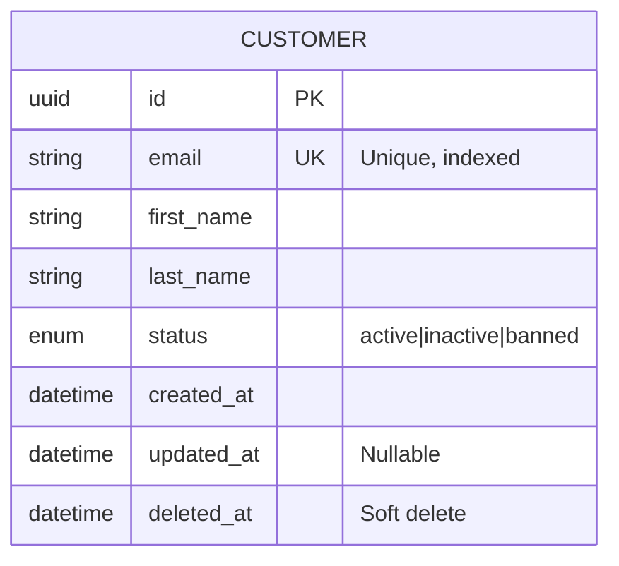

### Relationship Examples

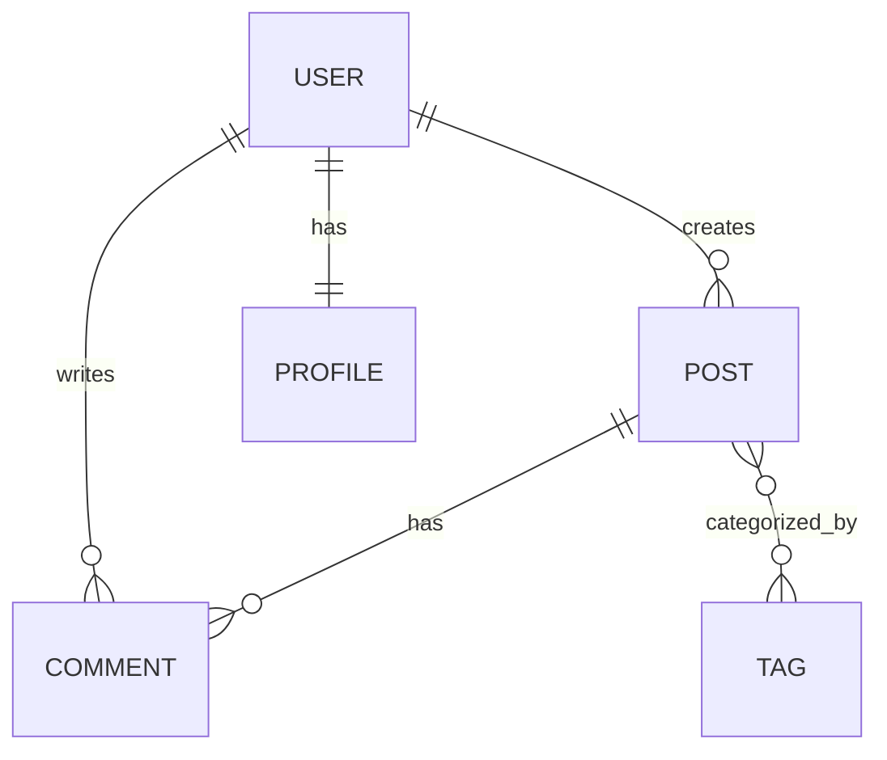

### Style Customization (Mermaid 10+)

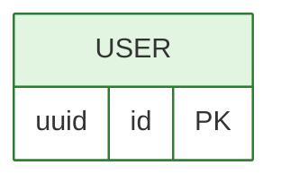

---

## Advanced Patterns

### 1. Table Inheritance (Single Table vs Class Table)

**Single Table Inheritance** (when subtypes share most fields):
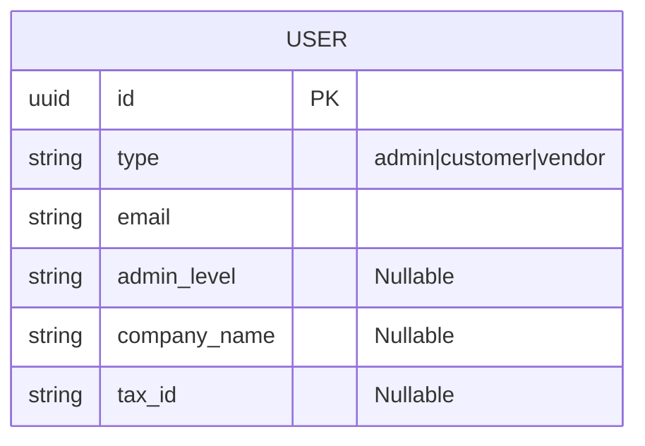

**Class Table Inheritance** (when subtypes have distinct fields):
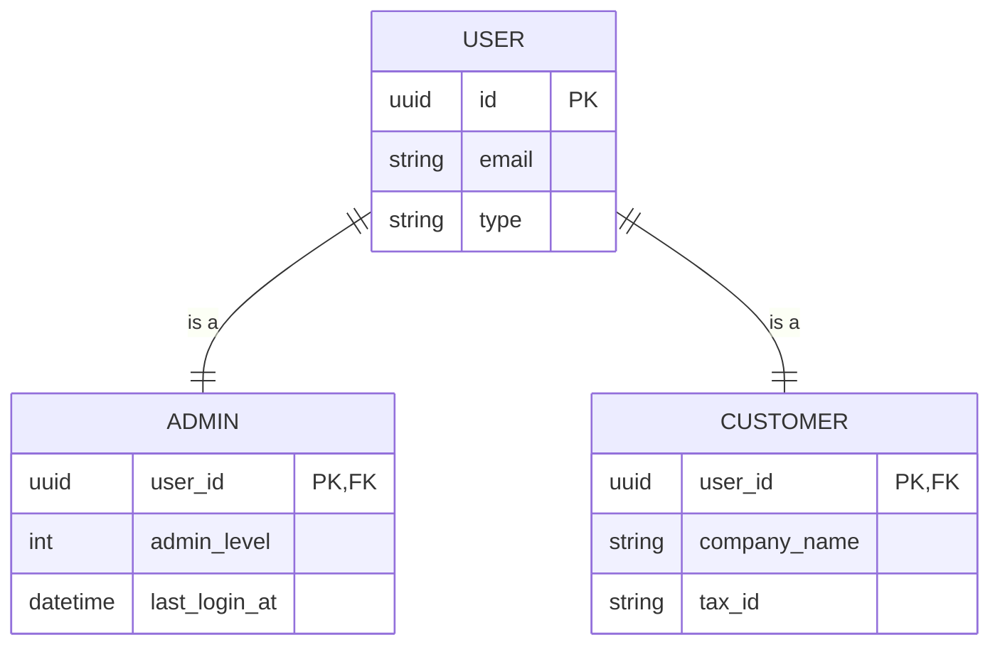

### 2. Soft Deletes

Always include `deleted_at` for business entities:
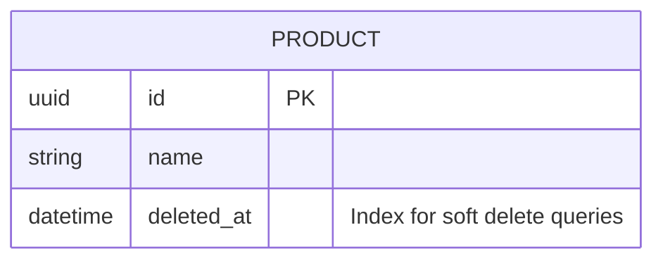

Query pattern: `WHERE deleted_at IS NULL` (or use partial indexes).

### 3. Multi-Tenancy

**Shared Database, Schema per Tenant**:
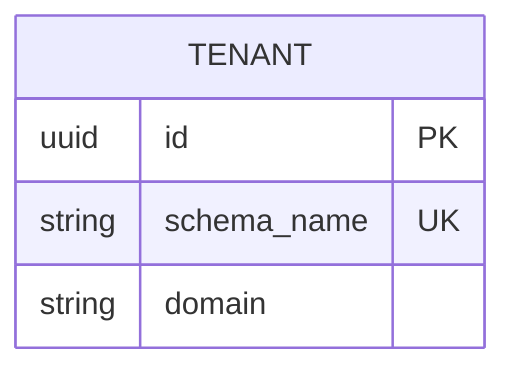

**Shared Database, Shared Tables** (tenant_id column):
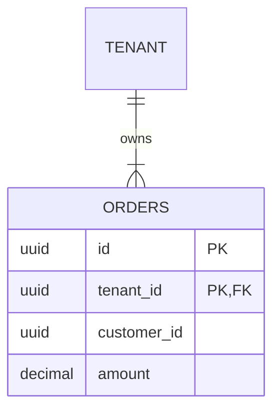

### 4. Audit Trail

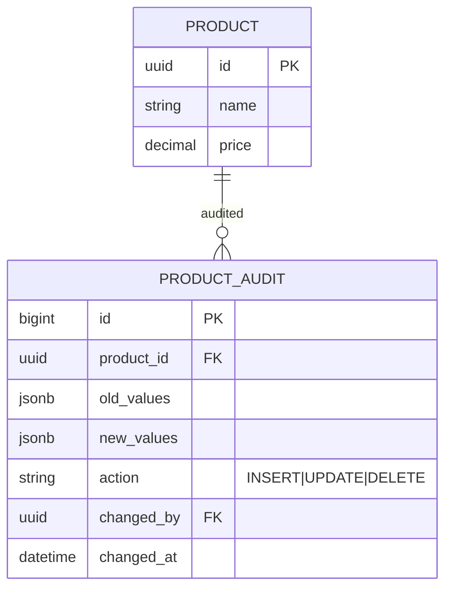

### 5. Many-to-Many with Payload

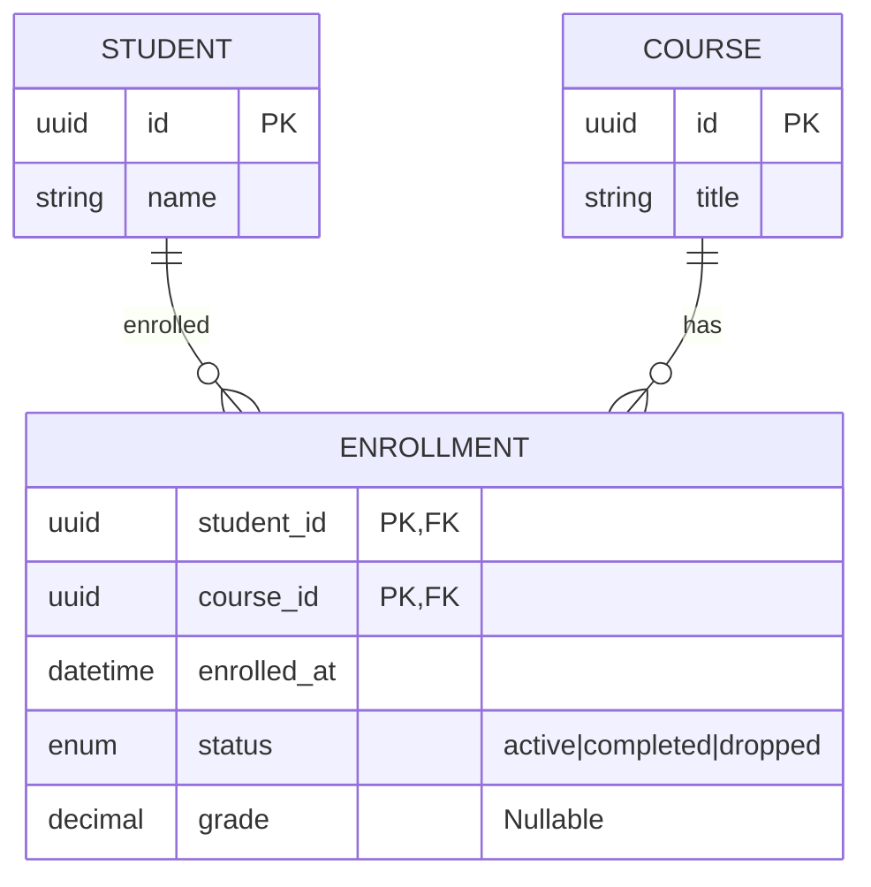

### 6. Self-Referencing Relationships

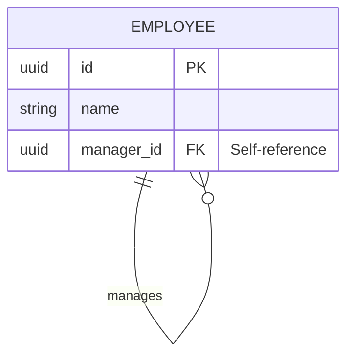

### 7. Polymorphic Associations (Content Tagging)

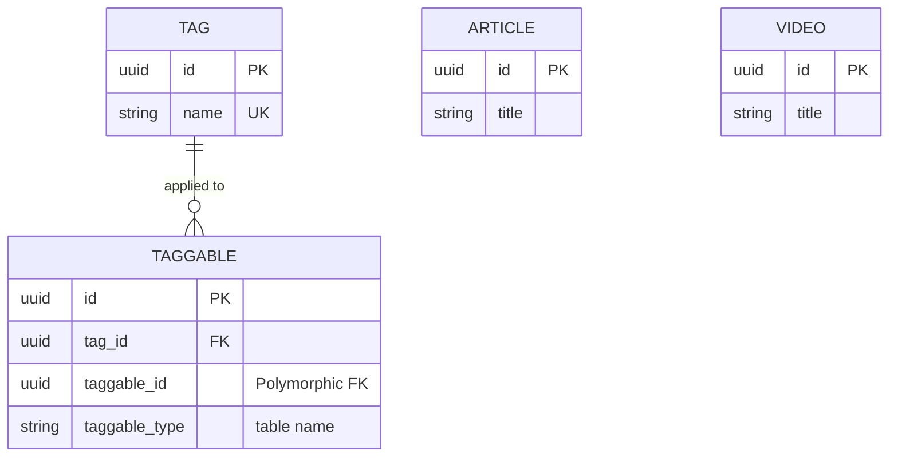

---

## DB Types by Engine

### PostgreSQL

| Concept | Type |
|---------|------|
| UUID | `uuid` (use `gen_random_uuid()`) |
| JSON | `jsonb` (indexed with GIN) |
| Arrays | `text[]`, `int[]` |
| Enum | `CREATE TYPE status AS ENUM (...)` |
| Money | `decimal(19,4)` (never `money` type) |
| Full-text | `tsvector` + `tsquery` |
| Range | `daterange`, `int4range` |
| Geographic | `geometry(Point,4326)` (PostGIS) |

### MySQL

| Concept | Type |
|---------|------|
| UUID | `binary(16)` (convert from char) |
| JSON | `JSON` (5.7+) |
| Enum | `ENUM(...)` |
| Money | `decimal(19,4)` |
| Full-text | `FULLTEXT INDEX` on `InnoDB` |

### MongoDB

| Pattern | Approach |
|---------|----------|
| References | `DBRef` or manual refs |
| Embedded | Subdocuments for 1:few |
| Array of refs | For 1:many read-heavy |
| Polymorphic | `discriminatorKey` in Mongoose |

---

## Normalization Guide

### 1NF: Atomic Values
- No repeating groups
- Each cell contains single value
- **Violation**: `tags: "red,blue,green"` → Fix: Separate table or array type

### 2NF: No Partial Dependencies
- All non-key attributes depend on the FULL primary key
- **Violation**: In a composite PK `(order_id, product_id)`, `product_name` depends only on `product_id`

### 3NF: No Transitive Dependencies
- No non-key attribute depends on another non-key attribute
- **Violation**: `employee` table has `department_name` (depends on `department_id` which is FK)

### Denormalization Justifications
Acceptable when:
- Read-heavy, write-rarely (materialized views)
- Pre-computed aggregates for reporting
- Performance measured and proven (not assumed)
- Data duplication bounded and documented

---

## Common Schema Patterns

### E-Commerce
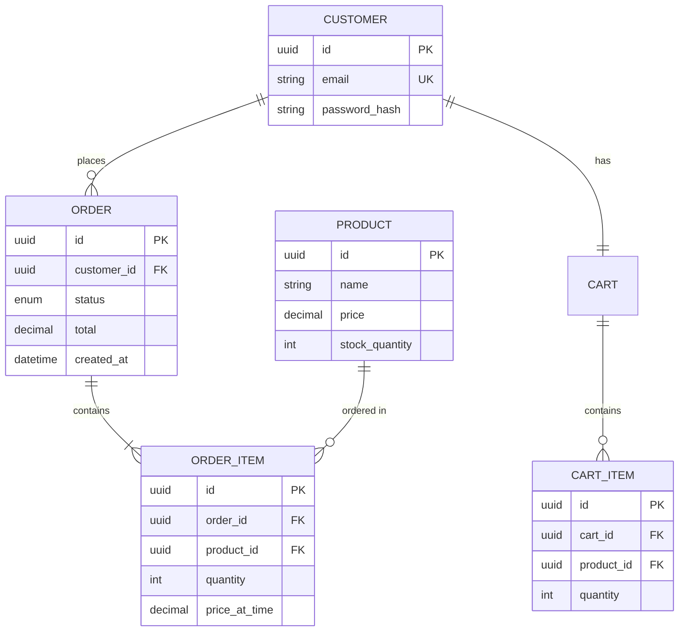

### SaaS with Workspaces/Teams
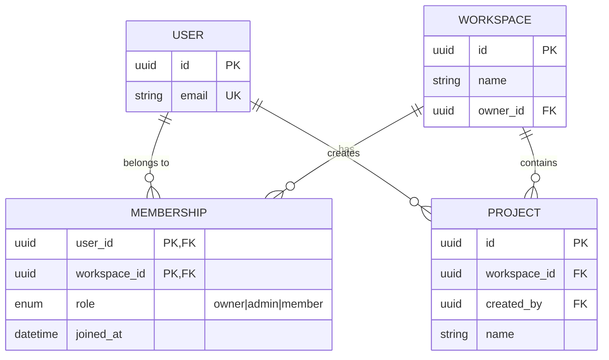

### Social/Media Platform
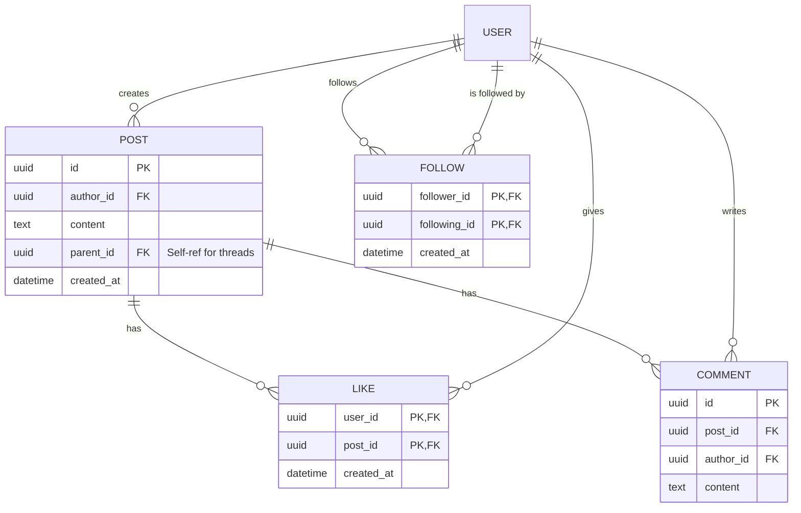
